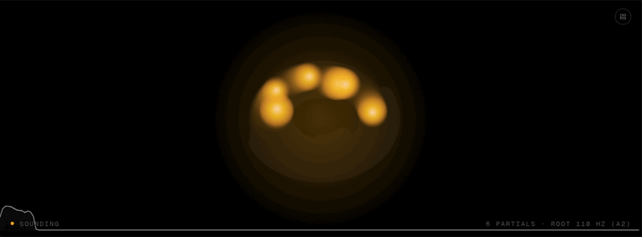

# AnnealMusic

[](https://github.com/akarlin3/annealMusic/actions/workflows/ci.yml)
[](https://github.com/akarlin3/annealMusic/actions/workflows/api.yml)
[](https://github.com/akarlin3/annealMusic/actions/workflows/deploy.yml)

**A browser instrument that generates endless, slowly-evolving ambient soundscapes — set a few sliders and let it drift. Good for focus, sleep, or background calm.**

### ▶︎ [Hear it in 10 seconds → anneal.averykarlin.org](https://anneal.averykarlin.org/)

No install, no account, nothing to download. Open the link, press **Begin**, and listen.



<!-- TODO: replace placeholder with a 6–10s, 800px-wide looping GIF of the visualizer reacting to sound + a slider move. Recipe in scripts/capture-demo.ts. -->

## What you actually do

- **Pick a base note** — the home note everything is tuned to. Lower for deep and weighty, higher for light and airy.
- **Shape the texture** — a few sliders set how wide, thick, and bright the sound is. Drag and you hear it change.
- **Set how much it drifts** — at zero it holds still; turn it up and the sound keeps gently reshaping itself with no input from you.
- **Switch the sound's character** — four different ways to make the raw sound, each with its own personality. And if you want: play along live, loop a phrase, record the result, or share it as a link.

New here? Press the **Help (?)** button in the app for a plain-language guide to every control, or take the 30-second walkthrough that pops up on your first visit.

## Feature tour

- **Four sound characters** — pure and glassy, metallic and bell-like, built from real recordings, or modeled real instruments (strings, pipes, plates). Switch any time.
- **Sessions & journeys** — play freely forever, or pick a timed "journey" that shapes the sound from gentle open to deep middle to calm finish, all on its own.
- **Play along live** — bring a guitar, voice, or any mic into the soundscape as another layer (headphones recommended).
- **Loop pedal** — record a phrase and let it repeat underneath; freeze it into an endless, breathing drone.
- **Recording** — capture exactly what you hear to a file you can keep or share.
- **Embed** — drop a tiny play-only player onto your own blog or website.
- **Gallery** — browse and load soundscapes other people have shared.
- **Share links** — copy a link that reopens your exact sound for anyone you send it to.

---

## For developers

Everything below is the engineering reference: stack, architecture, engine internals, and dev commands. Under the hood this is a generative ambient sandbox — coupled oscillators drifting over a harmonic lattice — with physics-driven sound and audio-reactive visuals.

## Tech stack

- **React 18** + **TypeScript** (strict, `noUncheckedIndexedAccess`)
- **Vite 5** build / dev server
- **Tailwind CSS 3**
- **Zustand** for the parameter store
- **Web Audio API** for synthesis (swappable engines + Ornstein–Uhlenbeck drift)
- **Canvas 2D** for the visualizer
- **Vitest** + jsdom for tests, **ESLint** + **Prettier** for quality

## Dev commands

```bash
npm install        # install dependencies
npm run dev        # start the Vite dev server (http://localhost:5173)
npm run build      # typecheck + production build to dist/
npm run preview    # preview the production build
npm run test       # run unit tests (Vitest)
npm run lint       # ESLint
npm run typecheck  # tsc --noEmit
npm run format     # Prettier --write
```

## Project structure

```
src/
  audio/         # orchestrator (session machine, post-fx, drift, crossfade, input), IR
    engines/     # AnnealEngine interface, sine + fm + granular + physical, registry
    engines/physical-dsp/      # pure string/tube/plate DSP (single source of truth)
    engines/physical-worklets/ # AudioWorkletProcessor wrappers (bundled separately)
    granular/    # GrainCloud core, look-ahead scheduler, window math
    sources/     # curated source bank registry + lazy loader
  session/       # arc data model, preset arcs, easing curves, ArcRunner
  input/         # InputVoice (live-input chain), devices, latency, meter
  loop/          # LoopSlot state machine, capture, SeamLoopPlayer, GranularPlayer, windows
  record/        # RealtimeRecorder, OfflineRenderer, recorder hook + dialog, My Recordings
  embed/         # standalone embed player (separate Vite entry), theme, embed dialog
  components/    # Visualizer, ControlPanel, EngineSelector, InputPanel, LoopPedal, …
  hooks/         # useAnnealMusic (orchestration), useSession, useInput, useLoops
  state/         # param store, defaults, control schema
  visual/        # canvas draw loop, palette, math helpers
  pages/         # App, RecordingPage (/r/<slug>)
  styles/        # global css + slider styles
  types/         # shared types
  test/          # vitest setup + Web Audio mock
  share/         # URL state schema, encode/decode, hash read/write
docs/            # INIT_PLAN, ROADMAP, COMPAT, MODELS, RECORDING, EMBED, version plans
```

## Engines

Synthesis is organized around a small **engine interface** (`AnnealEngine`):
every engine builds its own voices and exposes a single output node, while the
**orchestrator** owns the shared physics (root, spread, density, coupling,
drift) and post-fx (brightness filter, reverb space, volume) and pushes
per-partial detune from the drift loop into the active engine. This makes
engines hot-swappable: pick one from the segmented control under the header and
the orchestrator **crossfades** (equal-gain) without a page reload. Each engine
can request its own crossfade window — granular asks for ~800ms (vs the ~600ms
default) to mask grain start-up; sine/FM use the default.

- **Sine** — the coupled sine bank: one sine oscillator per partial over the
  harmonic lattice. No engine-specific params.
- **FM** — two-operator FM per partial: a sine carrier at the partial frequency,
  a modulator at `carrier × Ratio` with depth `Index × carrier` Hz, plus
  optional modulator self-**Feedback**. Params: **Ratio** (0.5–4), **Index**
  (0–10), **Feedback** (0–1).
- **Granular** — one grain cloud per partial, all reading the same curated
  source buffer (see [Granular engine](#granular-engine)). The partial's pitch
  sets the grain playback rate; drift detunes it like the other engines.
- **Physical** — per-partial digital waveguide / modal DSP in AudioWorklets,
  continuously excited for sustain. Three sub-models (string / tube / plate). See
  [`docs/MODELS.md`](docs/MODELS.md).

Sine and FM share the same baseline + slow-LFO amplitude shape, so switching
between them changes timbre without changing the field's envelope.

### Granular engine

Granular synthesis sprays short Hann-windowed **grains** read from a source
buffer. The reusable core is `GrainCloud` (`src/audio/granular/`), which also
powers the v0.6 loop-pedal freeze — one granular implementation, two consumers.
The engine runs N clouds over the harmonic lattice (one per partial); each
partial's frequency maps to a per-cloud `pitchOffset` in cents, so grains play
the source faster/slower to voice the harmonic, and the drift loop's detune
rides on top exactly as for sine/FM.

The source is picked from a curated bank (the **source picker** card grid);
sources load lazily on selection (Opus, ~96 kbps, fetched same-origin and
decoded once per session). Grain params are shared across the bank: **Grain**
size (30–300 ms), **Density** (4–40 grains/s _per partial_), **Jitter**
(position spread 0–1), **Pitch Jit** (per-grain cents 0–100), and **Center**
(0–1, where in the source grains cluster). `Center` also drifts on its own, so a
static patch keeps moving. A soft ceiling on simultaneous grains degrades
gracefully (sparser texture) rather than glitching under extreme settings.

See [`docs/SOURCES.md`](docs/SOURCES.md) for the source bank and
[`LICENSES.md`](LICENSES.md) for per-source licensing (all v0.9 sources are
original, CC0).

## Session modes

A session runs in one of two modes, chosen with the **Mode** toggle next to the
engine selector:

- **Open** — the original behavior: press Begin and the field drifts forever
  while you sculpt at will.
- **Arc** — a fixed-duration session that scripts the parameters along a preset
  envelope and automates itself to completion. Pick a preset and a duration
  (3–60 min, default 10), press Begin, and the arc plays: sculpt controls are
  locked (showing live interpolated values), a progress bar with segment markers
  runs across the visualizer, and the last 4 seconds fade out (`RETURNING`)
  before the session settles back to idle.

Three preset arcs ship in v0.4: **Bell Curve** (open, deepen, return),
**Dawn** (sparse and dark, gradually opening), and **Dusk** (bright and open,
gradually closing). Arc targets are multipliers on your pre-session sculpting, so
your starting patch is the neutral pose the arc deforms from. Arc timing rides on
the `AudioContext` clock, so long sessions stay accurate. (Both current engines
lock density while playing, so Dawn/Dusk's density move is held — they sweep
brightness and spread instead.)

## Live input

Bring a live instrument — bass, guitar, voice, anything mic'd — into the texture
as another voice. Click **Connect input** in the Input panel to grant microphone
access (the prompt is per click; we never re-prompt aggressively). Once
connected, the signal runs through its own chain — an 80 Hz high-pass, a gentle
compressor, your **Input Level**, and a drift-modulated filter that tracks the
same field as the engine — and into the shared post-fx, so it sits _inside_ the
field rather than on top of it.

A few deliberate choices:

- **Browser audio processing is disabled.** `echoCancellation`,
  `noiseSuppression`, and `autoGainControl` are turned off so the signal hits the
  engine clean — those features are tuned for speech on a call and mangle music.
- **Monitoring is off by default.** You hear yourself acoustically or through
  your amp/instrument; the AnnealMusic field is best heard on **headphones**.
  Turning monitoring on routes your processed input to the speakers — which can
  feed back, so use headphones. A guard dims monitoring if it detects sustained
  runaway level.
- **For best results, use headphones** (prevents feedback and keeps the input
  clean).
- **Latency** is shown as an estimate ("~30 ms input latency") so you can
  compensate — Web Audio doesn't expose true input latency, so it's a labeled
  estimate, not a measurement.
- Input is **never saved or shared**: it's a runtime/hardware concern, absent
  from the URL. It stays controllable in every mode and survives engine swaps and
  arc start/stop.

For wiring up an audio interface (bass DI, guitar, mic), see
[`docs/INPUT_GUIDE.md`](docs/INPUT_GUIDE.md).

## Loop pedal

Capture the live input into one of **three loop slots** (A / B / C), play them
back seamlessly, layer them, and **freeze** any of them into an endless granular
drone. Loops tap the input _after_ its voice chain (compressed, high-passed,
drift-modulated), so they sound like the input as it currently sits in the
field, and they sum into the same post-fx as the engines.

- **Capture** is not metronomic — there's no tempo or click. Arm a slot, and it
  starts recording on the first sound; stop it (or hit the 60-second cap) to
  commit. Captures shorter than 250 ms are discarded.
- **Seamless looping**: buffers loop with a short equal-power crossfade at the
  seam (≤120 ms, scaled to buffer length) so there's no click.
- **Freeze = granular re-synthesis**: a frozen slot stops looping linearly and
  continuously triggers short Hann-windowed grains from wandering positions in
  the buffer — a single chord becomes an infinite drone of itself. Grain
  **size**, **density**, **position jitter**, and **pitch jitter** are
  per-slot sliders; an optional **drift-coupled** toggle ties grain wander to
  the same drift field.
- **No undo.** Re-arming a slot overwrites its capture.
- Loops are independent of session state — they keep playing through engine
  swaps and arc start/stop, like the input does.

**Keyboard control** (a loop pedal wants hotkeys):

| Key           | Action                                         |
| ------------- | ---------------------------------------------- |
| `1` `2` `3`   | Slot A/B/C: arm → capture → (then) mute/unmute |
| `Shift+1/2/3` | Freeze ↔ unfreeze the slot                     |

Keys are ignored while a text field/slider/select is focused, and when a
modifier other than Shift is held (so browser tab shortcuts aren't shadowed).

Captured **audio** never goes in the URL (that's the wrong place for buffer
data — v0.7's backend will handle buffer sharing). Loop **parameters**
(muted / frozen / grain settings) do ride along in the share link. See
[`docs/LOOP_GUIDE.md`](docs/LOOP_GUIDE.md).

## Sharing

The full sculptable parameter set (everything except volume, which is a per-user
listening preference) is encoded in the URL fragment, so any session is
shareable as a link. Click **Copy Link** in the header to copy the current
state; opening that link restores the parameters before the first sound. The
fragment uses a versioned, human-readable schema — `#s=<version>:<key=value…>` —
and updates live (debounced) as you sculpt, via `history.replaceState` so it
never pollutes browser history.

Schema **v5** adds the granular engine: `e=granular` plus its params under the
short `gr` namespace — `gr.source` (a stable source **index**), `gr.size`,
`gr.density`, `gr.posJitter`, `gr.pitchJitter`, `gr.posCenter`. (The engine id
stays `granular`; the namespace is `gr` to keep links compact.) This sits on top
of v4's per-slot loop config — flags (`L<id>.m`/`f`/`c` for muted/frozen/
drift-coupled) and, for frozen slots, grain params (`L<id>.gs/gd/gp/gx`) — v3's
session mode (`m=<open|arc>`, plus `arc=<id>&dur=<sec>`), v2's engine selector
(`e=<id>`), and namespaced engine params (e.g. `fm.modRatio`). Older schemas
(v1–v4) still load. Buffer **audio** is never encoded. Example (a granular
session):

```
https://anneal.averykarlin.org/#s=5:m=open&e=granular&rootFreq=110&spread=1.00&density=6&coupling=0.30&drift=0.50&brightness=0.50&space=0.40&gr.source=2&gr.size=120&gr.density=14&gr.posJitter=0.30&gr.pitchJitter=0&gr.posCenter=0.50
```

A link with frozen slots but no buffers loads the slots **empty** with the
frozen/grain config remembered — capture into the slot and it applies on commit.
**v1**–**v3** links still load — earlier schemas ignore loop keys, v1/v2 are
interpreted as `mode=open` (v1 also as the sine engine). An unknown arc id loads
open mode with a notice, out-of-range values are clamped, malformed fragments
fall back to defaults, and links from a newer schema version load defaults and
surface a notice.

## Backend (v0.7)

A FastAPI + PostgreSQL + S3-compatible service in [`api/`](api) persists
user content — **patches** (the full encoded URL state), **captures** (loop-pedal
audio), and **recordings** (schema only; export is v1.0). Identity is
**anonymous-first**: every browser gets a stable `anonId` (UUID) on first save,
carried in the `x-anon-id` header; no login. The client runs **fully with the
backend offline** — only Save / My Patches / `/p/<slug>` need it.

URLs are hierarchical: **Copy Link** still produces the self-contained inline
`#s=4:` link (works offline forever); **Save** mints a server short link
`/p/<slug>` and unlocks captures + the My Patches drawer. Saving defaults to
params-only; "include captures" is an explicit opt-in (uploaded as WAV, transcoded
to Opus, ref-counted server-side).

The URL schema stays the **single source of truth**: `npm run gen:schema`
compiles the TypeScript definitions into [`schema/manifest.v4.json`](schema),
which the server validates patch payloads against (a CI contract test fails on
drift). See [`docs/API.md`](docs/API.md) for the endpoint reference and
[`docs/DEPLOY.md`](docs/DEPLOY.md) for local dev (`docker compose up`: Postgres +
MinIO + API + web) and Railway deploy. Design rationale is in
[`docs/v0.7-PLAN.md`](docs/v0.7-PLAN.md).

The API deploys to **Railway** (managed Postgres); object storage is
**Cloudflare R2** (S3 API, zero egress). The web app stays on Firebase Hosting.

## Gallery (v0.8)

The [**`/gallery`**](https://anneal.averykarlin.org/gallery) route surfaces patches
their creators set to `public`. It's a separate, deep-linkable page — browse
anonymously, **Preview** a short audio thumbnail inline, and **Load** any patch
into the sandbox in one click. Sort (newest / oldest / most-loaded), filter
(engine, mode, has-captures), and full-text search are basic and predictable;
pagination is a stable "Load more" cursor.

Each card shows a **deterministic static frame** of the patch's visualizer (same
params → same art). Audio previews are **rendered server-side**: because the
engine is real-time and depends on the browser's Web Audio DSP, previews are
produced by playing the _real_ engine in **headless Chromium** and capturing 20 s
to Opus — same code, same sound. Rendering is async; a card shows "preview
rendering" until it's ready.

A patch becomes public only when its creator toggles it; flipping back to
`unlisted` removes it from the gallery within a minute. Publishing auto-screens the
title/description, and any card can be **reported** (`…` → Report) for review.
Moderation + the minimal `/admin` panel are documented in
[`docs/MODERATION.md`](docs/MODERATION.md) and [`docs/ADMIN.md`](docs/ADMIN.md);
design rationale is in [`docs/v0.8-PLAN.md`](docs/v0.8-PLAN.md).

## Continuous Integration & Deployment (CI/CD)

AnnealMusic uses GitHub Actions to automate quality gates and continuous delivery. Every pull request and push to the main branch triggers automated validation sweeps across both the client and API layers.

### GitHub Workflows

The repository runs three specialized pipelines:

#### 1. Client CI (`.github/workflows/ci.yml`)

Runs on all pushes and pull requests to ensure the frontend compiles and matches our quality criteria:

- **Environment**: Node.js 20 on `ubuntu-latest`.
- **Dependencies**: Restored cleanly via `npm ci` with caching.
- **Linting**: ESLint checks code quality (`npm run lint`).
- **Typechecking**: Strict TypeScript validation (`npm run typecheck`).
- **Testing**: Runs the Vitest test suite (`npm run test -- --run`) testing 338+ individual cases.
  > [!NOTE]
  > Native `localStorage` and `sessionStorage` in Node.js 22+/25+ can clash with JSDOM's virtual implementations. We use a custom memory-backed storage override in [setup.ts](file:///Users/averykarlin/annealMusic/src/test/setup.ts) to guarantee consistent test environments in CI.
- **Production Build**: Compiles AudioWorklets, compiles TypeScript bundles, and outputs static assets (`npm run build`).
- **Embed Size Gate**: Verifies that the React-free embed bundle stays within its performance budget (`npm run check:embed-size` < 50 KB).

#### 2. API CI (`.github/workflows/api.yml`)

Validates the FastAPI backend, database migrations, and schema schema contracts:

- **Testing**: Boots up Python 3.12 and runs the pytest suite (`pytest -q`).
- **Database Migrations**: Provisions a temporary live PostgreSQL container service, applies Alembic migrations, and verifies the schema is successfully upgraded to the latest revision.
- **Schema Contract Drift Guard**: Generates the latest JSON schema manifest (`npm run gen:schema`) and checks for code drift against `schema/` (`git diff --exit-code schema/`). This ensures the client-side TypeScript definitions and the backend Python validator are always in 100% agreement.
- **Deploy Verification**: Verifies the deployment readiness state once pushed to production by querying `/readyz`.

#### 3. Deploy & CD (`.github/workflows/deploy.yml`)

Automates publishing of the stable client to global CDNs:

- **Trigger**: Runs only after a successful execution of the main **CI** workflow on the `main` branch.
- **Build**: Compiles the final production-ready assets to `dist/`.
- **Deployment**: Leverages the official Firebase action to push to **Google Cloud Firebase Hosting** under the `live` channel.

---

### Setup & Deploy Guide

To configure the automatic deployment pipeline for your fork or environment:

#### 1. Firebase Configuration

1. Initialize or select a project in the [Firebase Console](https://console.firebase.google.com/).
2. Add your project ID to [`.firebaserc`](file:///Users/averykarlin/annealMusic/.firebaserc) as the `default` key (e.g. `annealmusic`) and reference it in `.github/workflows/deploy.yml`'s `projectId`.
3. Create a Google Cloud Service Account with the **Firebase Hosting Admin** role, export its JSON key, and add it as the `FIREBASE_SERVICE_ACCOUNT` repository secret in your GitHub settings.
4. Git push to `main` — once the `CI` workflow is green, the `Deploy` workflow will release the project.

#### 2. DNS & Custom Domains

Custom domains are served with managed SSL/TLS automatically. To bind `anneal.averykarlin.org`:

1. In the Firebase Hosting console, select **Add Custom Domain**.
2. Create the recommended **TXT** record at your DNS provider to verify ownership.
3. Configure the **A** records or **CNAME** pointers issued by Firebase at your domain registrar.
4. The SSL certificate will automatically provision and activate (typically within a few hours).

## Contributing

This is an early-stage personal project (v0.1). See [`docs/ROADMAP.md`](docs/ROADMAP.md)
for the planned trajectory. Each version is a focused slice; open an issue to
discuss before larger changes.

## License

[MIT](LICENSE).
