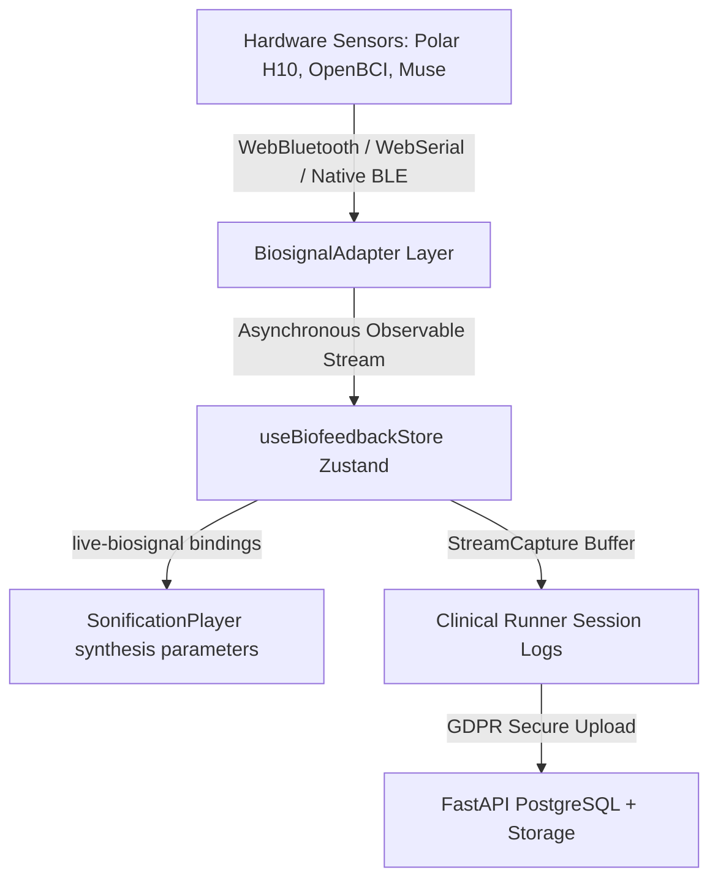

# Biofeedback Ingestion Framework

The **Biofeedback Ingestion Framework** (introduced in **v7.4**) enables real-time physiological telemetry (HRV, breath rate, EEG, GSR) to modulative generative audio synthesis parameter grids dynamically in the sandbox, as well as capture high-resolution participant telemetry inside clinical trials.

---

## 1. Architectural Overview

The framework acts as a bridge between low-level device communication protocols and high-level Web Audio synthesis nodes.



At its core, the framework consists of three principal layers:

1. **Low-level Adapters (`src/biofeedback/adapters/`):** Translate hardware-specific binary payloads over Web Bluetooth, WebSerial, and WebHID APIs into standard format arrays.
2. **Central Store (`src/biofeedback/store.ts`):** Coordinates connection states, sensor battery, signal quality, and buffers live metrics reactively.
3. **Capture & Calibration Engine (`src/biofeedback/StreamCapture.ts` & `src/biofeedback/CalibrationFlow.tsx`):** Coordinates participant opt-in choices, records active trial intervals, executes pre-trial baseline calibrations, and uploads stream chunks safely to scientific files.

---

## 2. Supported Hardware Devices

| Device                       | Primary Metric                  | API                    | Data Protocol                                 |
| ---------------------------- | ------------------------------- | ---------------------- | --------------------------------------------- |
| **Polar H10**                | Heart Rate & R-R Interval (HRV) | Web Bluetooth          | Standard GATT Heart Rate Service (0x180D)     |
| **Polar Verity Sense / OH1** | Optical PPG / Heart Rate        | Web Bluetooth          | GATT Heart Rate Service                       |
| **OpenBCI Cyton**            | 8-Channel Raw EEG               | WebSerial              | 250Hz Binary Packet Decoding over Virtual COM |
| **Muse 2**                   | Raw EEG (Delta Band Power)      | Web Bluetooth          | GATT Muse BLE Protocol                        |
| **Empatica E4 / Emotiv**     | GSR / Skin Conductance          | WebHID / Web Bluetooth | Generic GATT Service Telemetry                |

---

## 3. Dynamic Sonification Bindings

Biosignals can be registered directly as a `'live-biosignal'` source in the **Sonification Engine** (introduced in **v7.1** and extended in **v7.3**). When mapped:

- **Heart Rate (BPM):** Can modulate composition tempo, envelope attack lengths, or FM modulator frequencies.
- **HRV R-R Interval (ms):** Can map to Kuramoto phase-coupling values, spectral brightness, or filter resonance parameters.
- **EEG Delta Power:** Can map directly to granular density, wave-shaper gains, or physical waveguide excitation thresholds.

Example parameter binding configuration:

```json
{
  "source_type": "live-biosignal",
  "channel_name": "hrv",
  "target_param": "FM_mod_index",
  "scale_min": 0.2,
  "scale_max": 4.5,
  "calibration_relative": true
}
```

---

## 4. GDPR Consent & Cascade Shredding

The system strictly adheres to **GDPR** and institutional ethics guidelines regarding human-subjects data:

- **Per-Channel Opt-In:** Participants are presented with individual opt-in checkboxes for every physiological channel defined in the protocol on the informed consent page. Blanket consent is prohibited.
- **Right to Discard:** If a participant chooses to withdraw from a trial and select "Discard All Telemetry", the system initiates a cascade delete.
- **Cascade Deletion:** The FastAPI backend physically deletes the Parquet telemetry data blocks from the S3/local object storage server and unlinks the db record immediately, retaining only secure consent/withdrawal event audit trails for compliance validation.

---

## 5. Baseline Calibration Wizard

To prevent raw physiological values from saturating synthesizer parameter bounds, participants complete a short baseline calibration before stimulus playbacks:

- **HRV (60-second baseline):** Sit comfortably and breathe naturally to compute average resting R-R intervals and baseline **SDNN** (Standard Deviation of Normal-to-Normal intervals).
- **EEG (10-second baseline):** Verifies impedance values and establishes thresholds for eye-blink artifacts.
- **GSR (30-second baseline):** Measures resting tonic skin conductance levels (SCL).

Synthesizer parameter scaling is calculated dynamically relative to these baseline values, making the sonic sandbox deeply personalized to each participant's resting autonomic state.

---

## 6. Native Mobile Capacitor Plugins

For native iOS and Android applications, the Web Bluetooth/WebSerial APIs are not uniformly supported. The Capacitor native shells include a custom **`BiofeedbackBridge`** plugin:

- **iOS (`ios/Plugins/BiofeedbackBridge.swift`):** Leverages `CoreBluetooth` to scan and connect directly to GATT Heart Rate peripherals, feeding streams directly to the Web View.
- **Android (`android/app/.../BiofeedbackBridge.kt`):** Uses Android's BluetoothAdapter GATT callbacks inside background threads.
- **Mock Simulator Stream:** Includes built-in simulated heart-rate feeds to allow robust end-to-end telemetry testing in mobile simulators without requiring physical hardware.
