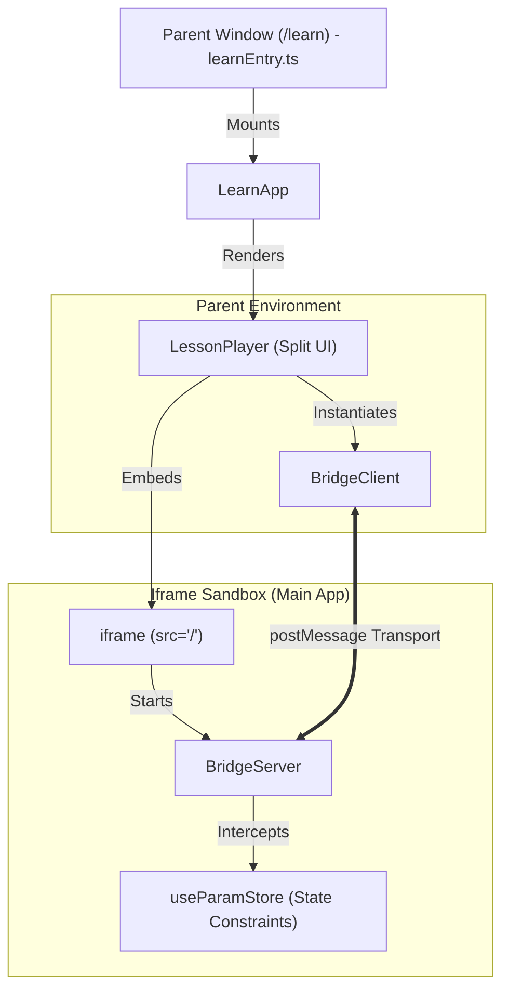

# Education Surface: Architecture & Lesson Player

The **Education Surface** (`/learn`) is AnnealMusic’s high-fidelity wellness and pedagogical environment. It provides a structured curriculum for phase-coupled synthesis, composition, and physical acoustics, allowing users to understand the mathematical and sonic relationships of the tool through interactive, self-paced explorations.

---

## 1. High-Level Architecture

The `/learn` route is compiled and served as a separate standalone bundle. This provides several critical engineering benefits:



### 1.1 Decoupled Bundle Strategy

- **Bundle Budget:** The compiled JS bundle for the education surface is **under 150KB raw (and only ~51KB gzipped)**.
- **Tree Shaking:** By separating it from the main build, we completely exclude the complex Web Audio synthesizer worklets, high-memory granular source buffers, collaborative WebRTC overlays, and WebWorker Pyodide runtimes. These load strictly inside the embedded main application iframe.
- **Vite Configuration:** Compiled using a dedicated config file `vite.config.learn.ts` outputting directly to `dist-learn/`.
- **FastAPI Routing:** The backend route `GET /learn` checks for production `dist-learn/learn.html` and falls back dynamically to development templates or guides.

### 1.2 Iframe Compositions & JSON-RPC Bridge

Rather than re-implementing the complex audio engine, the education surface embeds the live, fully featured instrument in a same-origin `<iframe>`.

- **Transport Layer:** Bidirectional communication is handled via standard, asynchronous same-origin `postMessage` messages wrapped in a `PostMessageTransport`.
- **JSON-RPC 2.0 Protocol:** Same protocol introduced in v5.0, running on top of the cross-window message interface.
- **Same-Origin Security:** The transport strictly asserts same-origin isolation:
  ```typescript
  if (event.origin !== window.location.origin) return;
  ```

---

## 2. Interaction Control & Constraints

To prevent users from getting overwhelmed, v6.0 introduces store-level **Parameter Sandboxing** to isolate specific synthesis behaviors taught in a given lesson step.

### 2.1 Zustand Constraint Guard

The global `useParamStore` contains a reactive `constraints: string[] | null` array. If active:

- Standard state-changing actions (`setParam` and `setEngineParam`) intercept and immediately drop updates to any parameter key not present in the whitelist.
- The instrument controls in `ControlPanel.tsx` (sliders, select dropdowns, toggles) detect this lock, automatically disable themselves, and render a dedicated lock indicator (`lesson`) to communicate the sandbox boundaries.

### 2.2 Visual Attention Cues (Pulse Highlights)

When a step wishes to direct the user's focus to a slider, it invokes the bridge method `anneal.lesson.highlight(controlKey)`.

- The main app dispatches a custom window event (`anneal-highlight`) targeting that specific element.
- The control slider renders a beautiful, pulsating amber glow border for **3 seconds**, cleanly directing the user's attention.

---

## 3. Pedagogical Step Types

Each lesson is built from a sequential array of step cards inside `src/learn/stepTypes/`:

1. **`TextStep`**
   - High-fidelity typography formatting introducing the concepts (e.g. drift, microtones, or intervals).
   - Renders a clean card containing key takeaways and visual bullet spacing.
2. **`DemoStep`**
   - Automatically executes the `loadPatch` bridge RPC to configure the synthesizer into a specific starting pose.
   - Triggers glow animations on key controls.
   - Provides a "Reset to Demo State" action to restore the patch.
3. **`PromptStep`**
   - Restricts parameter sliders using the constraint whitelists.
   - Challenges the user with hands-on, unblocked exploration (e.g. "adjust drift to break the synchronization lock").
4. **`ReflectionStep`**
   - Prompts the user with focused, open-ended questions.
   - Allows users to type observations into an elegant, custom-styled text area.
   - Follows Calm by Design principles: reflections are unblocked, voluntary, and saved locally in the player's state.

---

## 4. Calm by Design UX Compliance

In accordance with the **Calm by Design Manifesto** (`docs/CALM_BY_DESIGN.md`):

- **No Gamification:** The education surface strictly forbids levels, daily/weekly streaks, experience points (XP), leaderboards, or score counters.
- **Low-Contrast Progress:** Step progress is communicated using subtle progress dots (`• • ◦ ◦ ◦`) rather than flashy progression gauges or celebrations.
- **Reflection Privacy:** User observations are summarized locally at the end of a lesson inside a clean session review panel. These notes are completely private, unshared, and reside solely in the client state.
