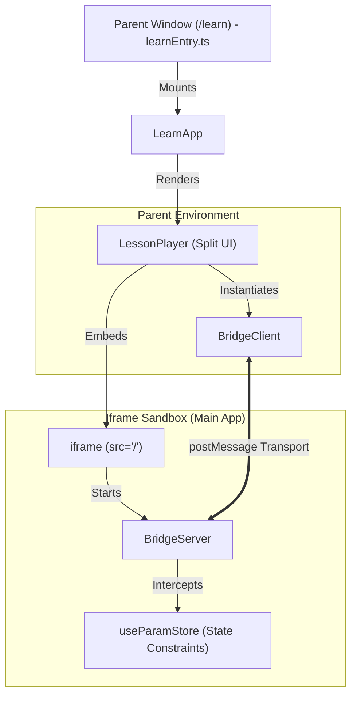

# Education Surface: Architecture & Lesson Player

The **Education Surface** (`/learn`) is AnnealMusic’s high-fidelity wellness and pedagogical environment. It provides a structured curriculum for phase-coupled synthesis, composition, and physical acoustics, allowing users to understand the mathematical and sonic relationships of the tool through interactive, self-paced explorations.

---

## 1. High-Level Architecture

The `/learn` route is compiled and served as a separate standalone bundle. This provides several critical engineering benefits:



### 1.1 Decoupled Bundle Strategy

- **Bundle Budget:** The compiled JS bundle for the education surface is **under 150KB raw (and only ~51KB gzipped)**.
- **Tree Shaking:** By separating it from the main build, we completely exclude the complex Web Audio synthesizer worklets, high-memory granular source buffers, collaborative WebRTC overlays, and WebWorker Pyodide runtimes. These load strictly inside the embedded main application iframe.
- **Vite Configuration:** Compiled using a dedicated config file `vite.config.learn.ts` outputting directly to `dist-learn/`.
- **FastAPI Routing:** The backend route `GET /learn` checks for production `dist-learn/learn.html` and falls back dynamically to development templates or guides.

### 1.2 Iframe Compositions & JSON-RPC Bridge

Rather than re-implementing the complex audio engine, the education surface embeds the live, fully featured instrument in a same-origin `<iframe>`.

- **Transport Layer:** Bidirectional communication is handled via standard, asynchronous same-origin `postMessage` messages wrapped in a `PostMessageTransport`.
- **JSON-RPC 2.0 Protocol:** Same protocol introduced in v5.0, running on top of the cross-window message interface.
- **Same-Origin Security:** The transport strictly asserts same-origin isolation:
  ```typescript
  if (event.origin !== window.location.origin) return;
  ```

---

## 2. Interaction Control & Constraints

To prevent users from getting overwhelmed, v6.0 introduces store-level **Parameter Sandboxing** to isolate specific synthesis behaviors taught in a given lesson step.

### 2.1 Zustand Constraint Guard

The global `useParamStore` contains a reactive `constraints: string[] | null` array. If active:

- Standard state-changing actions (`setParam` and `setEngineParam`) intercept and immediately drop updates to any parameter key not present in the whitelist.
- The instrument controls in `ControlPanel.tsx` (sliders, select dropdowns, toggles) detect this lock, automatically disable themselves, and render a dedicated lock indicator (`lesson`) to communicate the sandbox boundaries.

### 2.2 Visual Attention Cues (Pulse Highlights)

When a step wishes to direct the user's focus to a slider, it invokes the bridge method `anneal.lesson.highlight(controlKey)`.

- The main app dispatches a custom window event (`anneal-highlight`) targeting that specific element.
- The control slider renders a beautiful, pulsating amber glow border for **3 seconds**, cleanly directing the user's attention.

---

## 3. Pedagogical Step Types

Each lesson is built from a sequential array of step cards inside `src/learn/stepTypes/`:

1. **`TextStep`**
   - High-fidelity typography formatting introducing the concepts (e.g. drift, microtones, or intervals).
   - Renders a clean card containing key takeaways and visual bullet spacing.
2. **`DemoStep`**
   - Automatically executes the `loadPatch` bridge RPC to configure the synthesizer into a specific starting pose.
   - Triggers glow animations on key controls.
   - Provides a "Reset to Demo State" action to restore the patch.
3. **`PromptStep`**
   - Restricts parameter sliders using the constraint whitelists.
   - Challenges the user with hands-on, unblocked exploration (e.g. "adjust drift to break the synchronization lock").
4. **`ReflectionStep`**
   - Prompts the user with focused, open-ended questions.
   - Allows users to type observations into an elegant, custom-styled text area.
   - Follows Calm by Design principles: reflections are unblocked, voluntary, and saved locally in the player's state.

---

## 4. Calm by Design UX Compliance

In accordance with the **Calm by Design Manifesto** (`docs/CALM_BY_DESIGN.md`):

- **No Gamification:** The education surface strictly forbids levels, daily/weekly streaks, experience points (XP), leaderboards, or score counters.
- **Low-Contrast Progress:** Step progress is communicated using subtle progress dots (`• • ◦ ◦ ◦`) rather than flashy progression gauges or celebrations.
- **Reflection Privacy:** User observations are summarized locally at the end of a lesson inside a clean session review panel. These notes are completely private, unshared, and reside solely in the client state.

---

## 5. Progress Tracking & Resume (v6.3)

Progress is **private, per-account, and cross-device**. It exists only to let a learner pick up where they left off and to give the next-lesson picker signal — never to drive return frequency.

### 5.1 Data model

One `lesson_progress` row per `(user_id, lesson_id)` (migration `0021_v6_3_lesson_progress`):

| Field                                            | Meaning                                                                                                                                            |
| ------------------------------------------------ | -------------------------------------------------------------------------------------------------------------------------------------------------- |
| `state`                                          | `not_started` / `in_progress` / `completed`. **`abandoned` is never stored** — it is _computed_ (>30 days inactive) so the user can always resume. |
| `current_step_position`                          | The step to resume on.                                                                                                                             |
| `scroll_ratio`                                   | 0..1 scroll position within the step body (width-independent, layout-resilient).                                                                   |
| `started_at` / `last_active_at` / `completed_at` | Timestamps.                                                                                                                                        |
| `step_actions`                                   | A **bounded** (≤200) per-step log of `{step_position, action, ms, at}` — metadata only, no free text.                                              |
| `reflection_text`                                | Private; collected from `reflection` steps. Never published, **never sent to the LLM**.                                                            |

`api/app/services/progress_state.py` is the **single source of truth** for effective-state derivation, per-track aggregation, and the import merge (the `compute_stats` heuristic-drift rule). A lesson is `completed` when the learner reaches the last step and acknowledges it (`Next`/`Complete`).

### 5.2 Pause / resume

`src/learn/progress/ProgressClient.ts` persists progress in tiers: an **account** user's progress is written to the server (`POST /api/v1/lesson-progress`); an **anonymous** user's progress is written to `localStorage` only (key `am_learn_progress`) and never uploaded silently. `ResumeHandler.ts` restores the saved step + scroll on re-entry. Writes fire on step change, on `visibilitychange → hidden`, and on `beforeunload` (via `sendBeacon` so a closing tab still flushes). Resume is silent — no "Welcome back" modal.

### 5.3 Anonymous → account migration

On first sign-in, `importLocalProgress()` POSTs the buffered localStorage records to `POST /api/v1/lesson-progress/import`, which does an **idempotent max-merge** (keeps the more-advanced state, the max step position, the latest timestamps; concatenates+caps step actions; never downgrades `completed`; keeps an existing reflection over an imported one). On success the local buffer is cleared and a guard flag prevents re-import. Switching devices while anonymous loses progress (documented); the only mitigation is the gentle, once-per-session "sign in to keep your progress" nudge.

---

## 6. Next-Lesson Picker (v6.3)

When a learner finishes a lesson or arrives at `/learn`, the system offers **1–3** next lessons. It is an _offer_, never a funnel: every presentation pairs the cards with a permanent "browse all lessons" escape.

### 6.1 Algorithm (`api/app/services/next_lesson_ranker.py`)

- **Stage 1 — deterministic filter.** From the visible curriculum, keep lessons that are not already completed, whose prerequisites are all satisfied, whose difficulty is within ±1 level (`intro=0/intermediate=1/advanced=2`) of the anchor (the just-completed or most-recently-active lesson), and that are in the same or a related track (widening to other tracks only if fewer than 3 same/related candidates exist). Capped at 8 candidates.
- **Stage 2 — LLM ranking (Haiku 4.5).** The model receives a compact, **metadata-only** progress summary (completed lesson titles, current track + aggregate, a text-free step-signal digest, a coarse time-since-last-session bucket) and the candidate list, and returns an ordered 1–3 with a one-sentence rationale each. Output is validated against the candidate ids (hallucinations dropped), retried once, and falls back to the deterministic Stage-1 order with neutral rationales if the model is unavailable or returns invalid JSON.
- **Stage 3 — presentation.** `src/learn/recommend/NextLessonPicker.tsx` renders the calm cards (title + "why this next"), plus the browse escape.

### 6.2 Onboarding

A brand-new learner (no completions) gets a deterministic set of intro lessons across tracks (`source: "onboarding"`, no LLM call) plus "explore a track" chips, or can jump straight into a track's first lesson.

### 6.3 Caching & cost

A 5-minute per-process TTL cache keyed on a hash of the compact progress state returns identical recommendations without a second LLM call. The picker runs at most ~once per session; at Haiku 4.5 prices the per-learner monthly cost is cents.

### 6.4 Privacy

The ranker reads only `step_actions` metadata; `reflection_text` is never included in the prompt (a unit test asserts this), and the payload carries no PII.

---

## 7. Discoverability in the Main App (v6.5)

The main instrument surfaces relevant lessons in context, so a learner who wonders "how does this engine work?" can reach the matching lesson without hunting for `/learn`. Discoverability is **opt-out, understated, and built from a single primitive**.

- **`LessonHintLink` (`src/components/LessonHintLink.tsx`)** is the one component used everywhere. It renders either a muted "learn more" link or a small `?` icon, opens `/learn#lesson/<track>/<lesson>` in a **new tab** (so it never interrupts what you're making), and renders nothing when hints are hidden.
- **The maps live once** in `src/components/lessonHints.ts`: engine → lesson, `data-lesson-hint` id → concept lesson, and creative-mode → track. This is the heuristic-drift guard — there is exactly one place that decides "which lesson explains this surface."
- **Touchpoints:** the **engine selector** tooltip gains "Learn more about this engine →"; the **mode toggle** tooltips link to the relevant track; **controls** with a `data-lesson-hint` can show a `?` icon; and a single dismissable **first-time banner** ("New to AnnealMusic? Start with the intro lesson →") appears once for new users.
- **The global opt-out** is a "Show learning hints" switch in Account Settings (default on). Flipping it off suppresses every hint and the banner reactively, via the small external store in `lessonHints.ts`. The banner's dismissal persists independently in `localStorage`.

## 8. Lesson Analytics (admin-only, v6.5)

For curriculum iteration, the admin console gains an **Analytics** tab (`src/learn/admin/AnalyticsPage.tsx`) backed by `GET /api/v1/admin/analytics/{lessons,lessons/{id},tracks,clips}` and `POST /api/v1/admin/analytics/refresh` (all `x-admin-key`-gated).

- **Per-lesson:** view count, completion rate, average time-to-complete, a step-by-step **drop-off curve**, per-step time-on-step distribution, prompt "I tried it" vs skip ratio, and reflection-presence rate.
- **Per-track:** aggregate completion + **path popularity** (the lesson sequences learners actually walk, flagged on/off the prerequisite graph).
- **Per-clip:** play / replay / skip / exposure counts.
- **CSV export** for the lesson and clip tables.

The metrics are computed (`api/app/services/analytics.py`) from the existing `lesson_progress` data. The v6.3 navigation actions (`started`/`completed`) feed views and drop-off; v6.5 **additively** emits `clip_play` / `clip_replay` (audio-clip steps) and `prompt_tried` / `prompt_skipped` (prompt steps) so play/replay and tried/skip counts begin to flow without any schema break. A Postgres `lesson_analytics` materialized view (migration `0024`, refreshed nightly + on demand) is the production performance / BI rollup; the endpoints compute live so there is a single, portable, tested code path.

**Everything here is aggregate and admin-only** — no per-user data is ever returned (see `docs/PRIVACY.md` §5). There is deliberately no per-user analytics view, for anyone.
