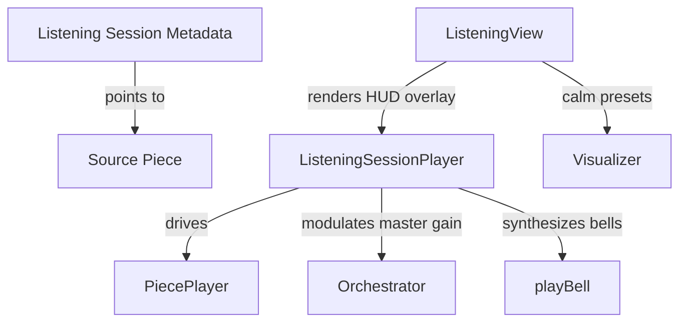

# Listening Sessions Architecture & Guide

Introduced in **v4.0**, a **Listening Session** is a first-class ambient artifact designed for the _listener_ side rather than the _creator_ side. While it uses the same underlying procedural audio engines as Patches and Pieces, it strips away the sculpting controls to provide a fullscreen, distraction-free, and immersive sensory environment.

---

## 1. Core Architecture

### 1.1 Metadata & Database Layer

A Listening Session is represented by the `ListeningSession` model in the database (`api/app/models.py`). It is a nullable wrapper around a source composed `Piece`:

- **Cascading Piece Deletion:** To respect design constraints where deleting the source Piece must not destroy the curator's session, `piece_id` is defined as nullable: `piece_id UUID REFERENCES pieces(id) ON DELETE SET NULL`. If the source Piece is deleted, the session gracefully falls back to a clean **"Source Unavailable"** alert UI.
- **Duration Calculation:** The session's `total_duration_ms` is computed at creation/update by taking the source Piece's total segment duration and adding `4000ms` for each enabled chime bell.

### 1.2 Dual-Resonator Bell Chime Synthesis

The opening and closing chime tones are fully synthesized at runtime using native Web Audio components (`src/listening/punctuation.ts`). This guarantees zero network assets or loading latency:

1. **Trigger pluck:** A 40ms buffer filled with random white noise: `Math.random() * 2 - 1`.
2. **Fundamental Resonator:** A `BiquadFilterNode` (type `bandpass`, frequency `660Hz`, `Q = 100`) capturing a pure, crystalline pitch.
3. **Overtone Resonator:** A `BiquadFilterNode` (type `bandpass`, frequency `990Hz` (1.5x), `Q = 80`) introducing a slightly metallic, harmonic character.
4. **Envelope Ramps:** Fast linear attack to `0.3`/`0.15` amplitude in `5ms`, followed by exponential decay down to `0.0001` over `4.0` seconds.

### 1.3 Timeline & Gain Automation

The session playback timeline is managed by the unified `ListeningSessionPlayer` (`src/listening/ListeningSessionPlayer.ts`). It wraps the standard `PiecePlayer` and orchestrates precise time intervals:

- **Opening Bell [4.0s]:** Volume is kept at absolute zero. The opening bell is triggered at `t = 0`.
- **Settle-In [Variable, default 30s]:** Piece playback starts. The master gain is linearly ramped from `0` to `1.0` (or `params.volume`) over the settle-in duration.
- **Sounding:** Piece plays normally at full volume.
- **Integration [Variable, default 60s]:** Master gain is linearly faded from `1.0` to `0` over the integration duration before the piece ends.
- **Closing Bell [4.0s]:** Volume is kept at absolute zero. The closing bell is triggered at the end of the piece.

---

## 2. Visualizer Calm Preset

To cultivate a serene atmosphere, both the Canvas 2D (`draw.ts`) and WebGL (`WebGLRenderer.ts` / `visual.frag.glsl`) renderers implement a strict **Calm Mode** activated by the `isCalm` flag:

1. **Slower Motion:** The phase velocity step `dt` of all orbiting partials is scaled down by `0.45` to encourage slower, drifting visual focus.
2. **Lower Peak Brightness:** All radial glows, input rings, loop rings, and halos have their alphas scaled down by `0.6` in both renderers to prevent eye strain in dim environments.

---

## 3. Offline Stem Render Integration

When exporting a Listening Session to a WAV master track via the **Stem Renderer** (`src/export/StemRenderer.ts`), all chimes and fades are programmatically baked into the offline buffer using native Web Audio automation timelines:

- **Start Offset:** If `openingTone` is active, the entire piece's timeline query `t` is delayed by `4.0s`.
- **Automation Schedules:** Linear gain ramps are scheduled on `masterVol.gain` at exact offline times matching the settle-in and integration fade boundaries.
- **Precise Syntheses:** The opening and closing bell nodes are created and PLUCKED directly into the `OfflineAudioContext` at `t = 0` and `t = startOffset + pieceDuration`.

---

## 4. How to Use

1. **Configure:** Open any composed Piece in the **Timeline Editor** and click the gold **Listen** button in the toolbar.
2. **Setup:** Set your intention, recommended environment, settle-in/integration durations, and toggle chimes. Save the session.
3. **Immerse:** You will be redirected to `/listening/:slug` where you can close your eyes, trigger the chimes, and enjoy the screen-space aesthetic.
