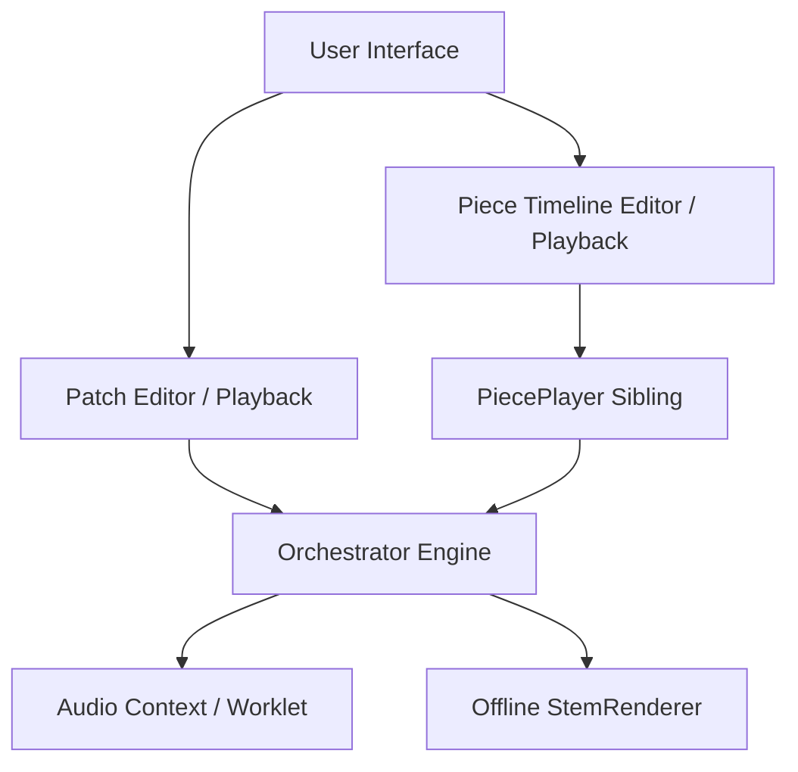

# AnnealMusic v3.0 · Pieces & Timeline Architecture

This developer guide describes the data model, URL serialization, engine playback orchestrator, visual timeline editor, and offline rendering pipeline of the **Piece** first-class artifact introduced in AnnealMusic v3.0.

---

## 1. Architectural Overview

Prior to v3.0, the core audio generation in AnnealMusic was dictated strictly by a **Patch**—a single static parameter state (sculpted interactively or driven hands-off by a preset session Arc).

In **v3.0**, we introduce the **Piece**. A Piece represents an ordered sequence of horizontal **Segments** on a timeline, each governing the synthesis parameter behavior for a dedicated time duration. Patches and Pieces coexist as peer, first-class deliverables.



---

## 2. Database Schema & Models

Pieces persist in the PostgreSQL database (SQLite during local testing) using a cascade relationship across two tables.

### 2.1 Database Schema

```sql
CREATE TABLE pieces (
  id                 UUID PRIMARY KEY,
  user_id            UUID NOT NULL REFERENCES users(id) ON DELETE CASCADE,
  schema_ver         INTEGER NOT NULL,
  defaults_state     JSONB NOT NULL,         -- Base patch-state defaults (params/engine)
  title              TEXT,
  description        TEXT,
  visibility         TEXT NOT NULL DEFAULT 'unlisted',
  ai_description     TEXT,
  total_duration_ms  INTEGER,                -- Nullable for indefinite open pieces
  has_open_segment   BOOLEAN NOT NULL DEFAULT FALSE,
  created_at         TIMESTAMPTZ NOT NULL DEFAULT now(),
  updated_at         TIMESTAMPTZ NOT NULL DEFAULT now(),
  short_slug         TEXT UNIQUE
);

CREATE TABLE piece_segments (
  id              UUID PRIMARY KEY,
  piece_id        UUID NOT NULL REFERENCES pieces(id) ON DELETE CASCADE,
  position        INTEGER NOT NULL,          -- 0-indexed ordering sequence
  type            TEXT NOT NULL,             -- 'fixed' | 'arc' | 'open' | 'transition'
  duration_ms     INTEGER,                   -- Nullable for 'open' segments
  config          JSONB NOT NULL,            -- Segment override configurations
  UNIQUE(piece_id, position)
);
```

### 2.2 SQLAlchemy ORM Models (`api/app/models.py`)

- `Piece`: Represents the piece record, containing metadata, base defaults state, and dynamic relations.
- `PieceSegment`: Maps to segment lines, with an absolute `position` index mapping.

---

## 3. URL Schema Version 8 Spec

To support sharing timeline compositions offline, the base serialization schema has been bumped to **Version 8**.

### 3.1 Discriminator

For schema versions `< 8`, states automatically evaluate to `kind: 'patch'`. In Version 8, the state is discriminated at the root using the `kind` keyword.

### 3.2 Serialization Formats

- **Patch (v8)**: `#s=8:kind=patch&e=sine&rootFreq=140&...`
- **Piece (v8)**: `#s=8:kind=piece&title=Ambient%20Dream&def.e=sine&def.rootFreq=140&seg0.type=fixed&seg0.dur=5000&seg1.type=transition&seg1.dur=5000&seg1.easing=easeInOut`

All piece-level defaults are prefixed by `def.` (e.g. `def.rootFreq=140`). Individual segments are sequentially serialized under ordered indices (`seg0`, `seg1`, etc.).

---

## 4. Piece Engine & Timeline Player

Playback is driven by the `PiecePlayer` (`src/piece/PiecePlayer.ts`) that runs alongside the orchestrator.

### 4.1 Orchestrator State Machine

Conceptually, the legacy engine modes are consolidated into two distinct states under `SessionState`:

- `playing-patch`: Active open session or preset Arc playback.
- `playing-piece`: Active timeline composition playback driving sequential segment transitions.

### 4.2 Segment Interpolation (`src/piece/transitions.ts`)

During `transition` segments, the player interpolates parameters between adjacent segment frames. It supports three distinct easing shapes:

1. **`linear`**: Standard linear progress mapping.
2. **`easeInOut`**: Smooth cubic acceleration/deceleration (`t * t * (3 - 2 * t)`).
3. **`exponential`**: Exponential progression sweep.

---

## 5. Timeline Editor UI

The frontend visual composition studio is located in `src/piece/TimelineEditor.tsx` with properties drawer `src/piece/SegmentProperties.tsx`.

- **Visual Track Area**: Glassmorphic horizontal layout scrolling smoothly over time.
- **Segment Color Codes**:
  - `fixed`: Sleek, cool **Teal** indicating steady-state overrides.
  - `arc`: Organic **Indigo/Violet** indicating micro-journey automation.
  - `open`: Warm, alert **Crimson** designating an indefinite wait boundary.
  - `transition`: Radiant **Golden/Amber** indicating dynamic interpolation curves.
- **Interaction Gestures**: Drag-and-drop ordering, edge resizing of durations, properties editing.
- **Hold-Open Affordance**: When an `open` segment is playing, the transport enters a holding loop and surfaces a blinking "Advance Open Segment →" button to trigger the next segment.

---

## 6. Offline Rendering Stems Mixdown

For Pieces, the offline stem renderer (`src/export/StemRenderer.ts`) walks the sequential segments timeline, recalculating parameter states, resolving transition progressions, and compiling a unified offline rendering master mix-down.
