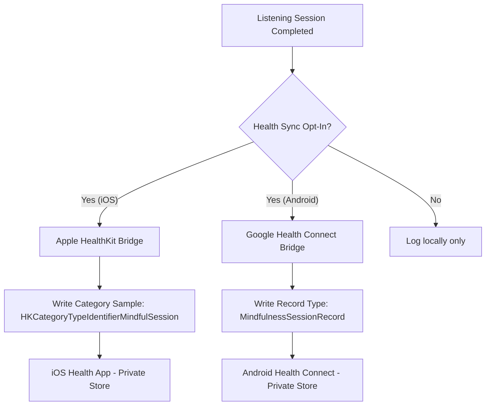

# Privacy & Data Flow Policy: Health & Session Tracking

At **AnnealMusic**, we believe that mindful listening should never come at the expense of your digital privacy. This document outlines our strict, privacy-first data handling policies, specifically regarding the **Health Platform Integrations** (Apple Health and Google Health Connect) and **Session History Tracking** introduced in the v4.6.0 milestone.

---

## 1. Core Privacy Commitments

1. **Strictly Opt-In**: Integrations with Apple Health (HealthKit) and Google Health Connect are **disabled by default**. We will never request permissions or attempt to access your health data stores unless you explicitly toggle them ON in your Account Settings.
2. **Local Processing Priority**: All listening session tracking occurs locally on your device. Session durations, start/end times, and active listening metrics are logged to your personal history.
3. **No Commercialization**: We do not sell, rent, or monetize your session history or health data. We do not integrate with third-party advertising SDKs, data brokers, or analytics companies.
4. **Data Portability**: You own your listening history. We offer a full, clean CSV export button under your settings so you can download and backup your data at any time.

---

## 2. Health Platform Data Flows

When you explicitly opt-in to sync your mindful activity, the application interacts with the native OS health databases as follows:

### 2.1 Apple Health (HealthKit - iOS)

- **Scope**: Write-only permissions to `HKCategoryTypeIdentifierMindfulSession` ("Mindful Minutes").
- **Behavior**: When a listening session or a stand-alone bell timer session exceeds 5 seconds, we write a category sample to your local Apple Health database. The sample contains only the starting timestamp, ending timestamp, and active duration.
- **Revocation**: You can disable this synchronization at any time in the settings panel. Doing so halts future write requests. Past entries saved to Apple Health remain there and can be removed by opening the built-in iOS Health App.

### 2.2 Google Health Connect (Android)

- **Scope**: Write-only permissions for the Jetpack Health Connect `MindfulnessSessionRecord` type.
- **Behavior**: Similar to iOS, upon completion of a session exceeding 5 seconds, the native Java bridge writes a Mindfulness Session Record containing your starting time, ending time, and duration.
- **Revocation**: You can revoke access at any time through your Android Settings -> Apps -> Health Connect -> AnnealMusic page or directly in our settings panel.

---

## 3. Persistent Session History (Backend)

To support multi-device synchronization and anonymous claims, we write your history to a secure SQL database:

- **Logged Fields**:
  - `listening_session_id`: Unique reference to the curated track (or `null` if using the standalone bell timer).
  - `started_at`: Starting datetime.
  - `completed_at`: Ending datetime.
  - `duration_seconds`: The actual elapsed time spent listening.
  - `is_standalone_timer`: Flag separating focus timers from synthesizers.
- **Security Bounds**:
  - Entries are tied strictly to your authenticated `user_id` or your cryptographically isolated `x-anon-id`.
  - The history export endpoint (`GET /me/sessions/export`) respects these authentication bounds and will never return history belonging to other users.
