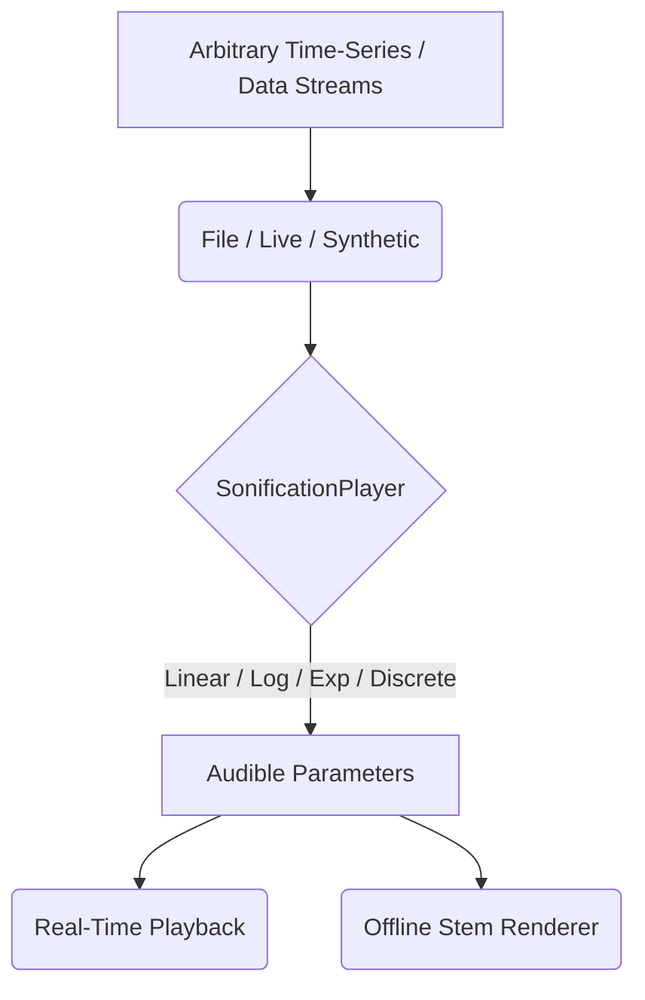

# Sonification Engine Guide (v7.1)

AnnealMusic v7.1 features a purpose-built, premium **Sonification Engine** designed for mapping arbitrary time-series or structured datasets to the real-time or offline synthesis faders. Developed in collaboration with the International Community for Auditory Display (ICAD), the engine emphasizes calibrated, deterministic, and highly reproducible mappings.

---

## 1. Core Architecture

The Sonification Engine operates by mapping one or more **Source Streams** to AnnealMusic's internal parameter matrix.

Each sonification consists of:

1. **Source Streams**: time-series data inputs from files (CSV, JSON), live connections (WebSocket, SSE), or synthetic mathematical expressions.
2. **Transform Functions**: mathematical algorithms mapping raw numbers into standardized perceptual bounds.
3. **Auditory Calibration**: manual perceptual scaling that aligns min/max bounds musically using context-aware active voice feedback.

---

## 2. Supported Data Sources

### A. Local and Server-Side Files

- **CSV and JSON**: Parsed fully in-browser to avoid server roundtrips, allowing files containing thousands of telemetry points to load instantly.
- **HDF5 and Parquet**: Since browser-based binary WASM readers exceed 3MB, the FastAPI backend handles parsing via native high-speed Python tooling (`h5py`/`pyarrow`) and returns structured JSON arrays to the client.

### B. Live Telemetry Streams

- **WebSockets (`ws://`, `wss://`)**: Connects to arbitrary live WebSocket interfaces, listening for JSON events, updating mapped parameter sliders at 50Hz.
- **Server-Sent Events (`http://`, `https://`)**: Standard EventSource subscribers for server-pushed metrics.

### C. Synthetic Generation

- **JavaScript Math Expressions**: Allows procedural generation of walks or patterns directly in the sandbox (e.g. `sin(t * PI) * 0.5 + 0.5`).

---

## 3. Scale Transformations

To map raw input values ($x$) to comfortable synth ranges ($y \in [\text{outMin}, \text{outMax}]$), the engine offers five specialized mathematical scales:

1. **Linear Scale**: Matches standard uniform transitions.
   $$y = \text{outMin} + \frac{x - \text{rawMin}}{\text{rawMax} - \text{rawMin}} \times (\text{outMax} - \text{outMin})$$
2. **Logarithmic Scale**: Best suited for physical metrics like frequency and decibels. Clamps values below `1e-5` for stability.
   $$y = \text{outMin} + \frac{\ln(x) - \ln(\text{rawMin})}{\ln(\text{rawMax}) - \ln(\text{rawMin})} \times (\text{outMax} - \text{outMin})$$
3. **Exponential Scale**: Produces natural crescendos and spectral decays.
   $$y = \text{outMin} + \frac{e^{x_{\text{norm}}} - 1}{e - 1} \times (\text{outMax} - \text{outMin})$$
4. **Discretized (Steps)**: Bins outputs into $N$ distinct quantization levels, creating stepped arpeggiations or discrete timbre changes.
5. **Quantiles**: Maps data elements into bins based on percentiles, making dense datasets highly readable.

---

## 4. Acoustic Calibration

Sonifications are creative _interpretive translations_, not pure raw measurements. Different scales or parameter matrices completely change the sonic identity.

To bridge this interpretive gap, **Calibration Mode** enables researchers to:

- Trigger active engine voices to play at the mapped `outMin` and `outMax` bounds.
- Audibly inspect the perceptual comfort limits (ensuring extreme telemetry points do not trigger painful squeals or complete silence).
- Drag the bounding sliders in real time to immediately lock in the calibrated range.

---

## 5. Offline Stem Rendering

Every sonification is fully serializable under schema version `21`.
When exported, the client or headless server triggers parallel `OfflineAudioContext` sweeps. The sequential render checkpoints query the `SonificationPlayer` to advance parameter envelopes deterministically, producing perfectly aligned, phase-coherent WAV files for research citations and share links.
