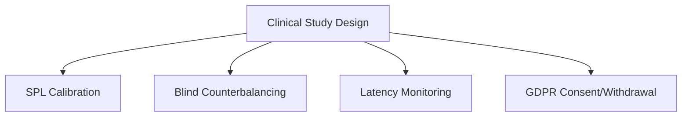

# Clinical Research & Music Cognition: Getting Started Guide

This guide is designed for cognitive neuroscientists, music psychologists, and clinical trial investigators who want to run auditory experiments, perceptual studies, or physiological music interventions using AnnealMusic.

AnnealMusic provides a highly controlled, stimulus-grade environment designed to meet the rigorous standards of Institutional Review Boards (IRBs) and international reproducibility standards.

---

## 1. Core Clinical Infrastructure

To ensure clinical-grade precision, AnnealMusic implements four main research pillars:

- **Physical SPL Calibration**: Guarantees that participants experience identical physical decibel levels, regardless of their specific hardware.
- **Williams Latin Square Counterbalancing**: Deterministically randomizes condition ordering, completely eliminating researcher selection bias.
- **Sub-Millisecond Onset Scheduling**: Leverages Web Audio thread clocks (`AudioContext.currentTime`) to schedule stimuli with sub-millisecond precision.
- **GDPR Cascade Shredding**: Guarantees that if a participant withdraws consent, their data is instantly and permanently deleted from all storage systems.

---

## 2. Setting Up Your First Clinical Study

### Step 1: Create the Study

1. Sign in to your investigator account.
2. Navigate to the `/research` panel.
3. Select the **Studies** tab.
4. Click **Create New Study** and fill out the title, abstract, and required funding/ORCID metadata.

### Step 2: Configure SPL Calibration

Before exposing participants to audio:

1. In your study settings, enable **SPL Calibration**.
2. Define your target physical decibel output (e.g., $65\text{ dBA}$).
3. When participants launch the study, they will play a calibrated $1\text{ kHz}$ reference tone at $-20\text{ dBFS}$.
4. They enter their hardware measurements or follow the pre-calibrated headphone profile checklist. The engine calculates the required multiplier:
   $$G_{cal} = 10^{\frac{G_{offset}}{20}}$$
   This ensures safe, consistent physical loudness.

### Step 3: Define the Stimulus Conditions

1. Link your synthesizer patches, audio clips, or dynamic sonification templates.
2. Configure your counterbalancing mode (e.g., **Williams Latin Square** or **Permuted Block**).
3. The server will dynamically assign subjects to their randomized sequence rows upon enrollment (`POST /api/v1/enroll_subject`), maintaining full single- or double-blind integrity.

### Step 4: Run the Participant Session

Participants complete the study using a clean, distraction-free environment served at:
`https://annealmusic.app/clinical/:studySlug`

This interface strips all standard app chrome (headers, footers, settings menus), leaving only the calibrated player, surveys, and safety triggers.

---

## 3. Human Subjects & Safety Protocols

> [!IMPORTANT]
> **Adverse Event Logs**: The clinical runner interface includes a prominent, floating **Symptom Trigger** or **Adverse Event Overlay**. If a participant experiences discomfort (headache, hearing strain, ringing), clicking the trigger immediately halts all audio, logs the precise sub-second offset of the symptom relative to the stimulus, and routes the participant to the withdrawal page.
