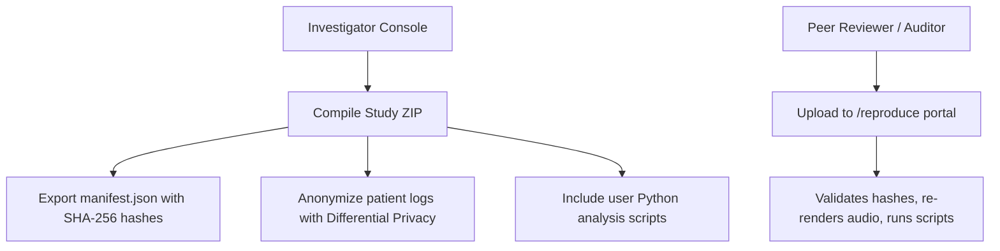

# Clinical Publishing Guide: Compliance & Reproducibility Requirements

High-impact scientific journals (_Nature_, _Frontiers_, _Journal of Neuroscience_) enforce strict standards for data availability, software version locking, and experimental reproducibility.

AnnealMusic v7.5 and v7.7 include dedicated tools to ensure your clinical auditory interventions are fully reproducible and compliant with these journals.

---

## 1. The Gold-Standard Reproducibility Pipeline

To meet journal peer-review requirements, avoid simply uploading raw data CSVs. Instead, export a self-contained **Reproducible Study ZIP Archive**:



### Steps to Compile Your Submission Bundle

1. Go to the `/research` panel and open your **Study**.
2. Click **Export Study Bundle (ZIP)**.
3. In the configuration dialog:
   - Select **GDPR Compliance Anonymization**.
   - Enable **Differential Privacy** (sets Laplace noise scaling for numeric ratings to protect subject identities).
   - Click **Generate ZIP**.
4. The backend compiles your stimuli manifests, user-authored Python scripts, SPL calibration history, and participant survey metrics into a single, hashed `.zip` archive.

---

## 2. Peer-Reviewer Verification Workflow

Provide peer reviewers direct instructions to verify your methodology:

> _"The full experimental protocol, dynamic synthesizer patches, and anonymized participant response logs are packaged as a self-contained reproducible bundle. Peer reviewers can upload the supplementary `.zip` archive to the AnnealMusic Auditor Portal at `https://annealmusic.app/reproduce` to automatically validate cryptographic hashes, re-render bit-identical stimulus waveforms, and re-execute the statistical analysis scripts in isolated sandbox environments."_

---

## 3. Formatting Citations for Clinical Journals

### Journal Style (e.g., JNeurosci / Frontiers)

> Investigator, K., & Research Group. (2026). _Auditory Entrainment via Phase-Locked Kuramoto Synthesis_ (Study Archive v7.7.0). AnnealMusic Zenodo Repository. https://doi.org/10.5281/zenodo.987654

### BibTeX Format

```bibtex
@misc{auditory_entrainment_study_2026,
  title        = {Auditory Entrainment via Phase-Locked Kuramoto Synthesis},
  author       = {K., Investigator and Research Group},
  year         = {2026},
  publisher    = {AnnealMusic Zenodo Repository},
  howpublished = {\url{https://annealmusic.app/s/auditory-sync}},
  doi          = {10.5281/zenodo.987654}
}
```
