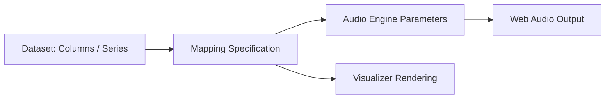

# ICAD Getting Started Guide: Onboarding to Generative Sonification

Welcome to the **AnnealMusic ICAD Sonification Workspace**. This guide is designed for researchers in auditory display, human-computer interaction, and domain sciences (physics, ecology, computational biology) looking to translate multi-dimensional datasets into high-fidelity, real-time auditory representations.

AnnealMusic uses client-side Web Audio synthesis and a highly parameterized physics-correct audio engine. Unlike static MIDI rendering, AnnealMusic supports continuous, dynamic, and interactive sonification mappings.

---

## 1. Core Concepts & Mapping Architecture

Sonification in AnnealMusic centers on the **Mapping Specification**, which maps numeric columns in a dataset to parameters of the synthesis engines:



### Synthesis Surfaces

You can choose from multiple built-in synthesis engines depending on your data characteristics:

- **FM Synthesis (Frequency Modulation)**: Excellent for continuous, highly vibrant changes (e.g., temperature, EMF fluctuations).
- **Physical Modeling (Digital Waveguides)**: Great for discrete events, transients, and physical impacts (e.g., rainfall ticks, heartbeats).
- **Spectral (Additive/Kuramoto Oscillators)**: Perfect for analyzing synchronization, complex networks, and phase relationships.

---

## 2. Step-by-Step Onboarding Workflow

### Step 1: Format Your Data

AnnealMusic accepts clean tabular data in **CSV** or **JSON Lines (JSONL)** formats.

- Ensure the first row contains clean, unique header names (no special characters).
- Remove absolute timestamps; instead, represent time in seconds as a column (e.g., `time_sec` or `offset`).
- Example CSV structure:
  ```csv
  time_sec,temperature,humidity,wind_speed
  0.0,22.4,54.1,1.2
  0.5,22.6,53.8,2.1
  1.0,22.5,53.5,1.8
  ```

### Step 2: Access the Sonification Panel

1. Sign in to your AnnealMusic account.
2. Navigate to the `/research` panel.
3. Select the **Sonification** tab.
4. Click **Upload Dataset** and choose your formatted CSV or JSON file.

### Step 3: Configure Mapping Bindings

Once the dataset is uploaded, AnnealMusic parses the headers. You can bind columns directly to engine parameters:

- **X-Axis (Time progression)**: Map to your time column.
- **Pitch/Frequency**: Map to columns representing continuous metrics (e.g., temperature).
- **Intensity/Volume**: Map to secondary metrics.
- **Granular Density/Kuramoto Coupling**: Map to relational or entropy measures.

### Step 4: Run Auto-Calibration

Before launching the auditory display:

1. Click **Auto-Calibrate Ranges**.
2. AnnealMusic automatically scans your dataset, determines min/max bounds, and scales them into safe parameter boundaries:
   - Frequencies are mapped to a logarithmic scale (typically $220\text{ Hz}$ to $880\text{ Hz}$).
   - Decibel bounds are normalized to prevent digital clipping.
3. Click **Orchestrate** to run the live synthesis.

---

## 3. Auditory Display Best Practices

When designing your auditory display, observe the guidelines developed by the International Community for Auditory Display (ICAD):

> [!TIP]
> **Avoid Parameter Overload**: Map no more than 3–4 parameters to a single auditory stream. If you have more variables, decouple them into separate voices or utilize spatial/stereo panning.
>
> **Establish Reference Tones**: Before presenting your sonification, provide listeners with a calibration tone (such as the standard $1\text{ kHz}$ reference) to align their listening environments.
>
> **Honest Limitations**: Declare what your sonification abstracts or hides. Fast transients might be smoothed out by high Web Audio buffer intervals. Be explicit in your supplementary materials.
