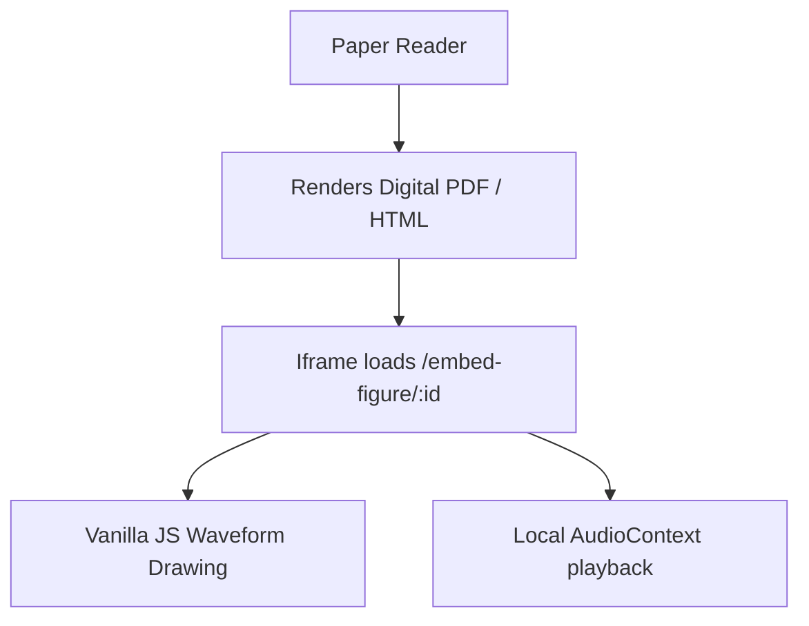

# ICAD Publishing Guide: Embedding & Disseminating Auditory Figures

Publishing sonification research requires providing peer reviewers and readers direct access to the audio-visual artifacts discussed in your text. Static charts are insufficient for auditory display.

AnnealMusic v7.6 and v7.7 provide a complete suite of academic publishing tools for the **International Conference on Auditory Display (ICAD)**, **IEEE Transactions on Audio, Speech, and Language Processing**, and adjacent conferences (NIME, ISMIR, SMC).

---

## 1. Embedding Interactive Figure Widgets

For digital journal platforms, online proceedings, and personal research pages, embed the active, interactive player directly into the text using a lightweight, zero-dependency `<iframe>` widget.



### Iframe Code Snippet

To embed a figure, use the following template. Adjust the query parameters to match the styling and theme of the publisher:

```html
<iframe
  src="https://annealmusic.app/embed-figure/c1f73752-d178-4395-849c-d07f35bde2ef?theme=light&bg=ffffff&fg=1c1917&accent=8b5cf6"
  width="100%"
  height="140"
  frameborder="0"
  allow="autoplay; clipboard-write"
  title="Interactive Sonification Figure"
></iframe>
```

---

## 2. Generating Video Abstracts for IEEE / ACM

Many traditional publishers (IEEE Xplore, ACM Digital Library) do not allow active script execution (like HTML5 widgets) in their core PDF platforms. To comply with these systems, export a high-fidelity **Video Abstract** or supplementary `.mp4` file:

1. In the **Studies** panel, select your study.
2. Under **Renders**, select **Request Video Export**.
3. Choose your format (1080p landscape or 720p square) and click **Queue Render**.
4. The background Playwright service will record the visualizer canvas stream and Web Audio destination, outputting a highly compatible H.264/AAC `.mp4` file.
5. Download the `.mp4` and its accompanying `.bib` BibTeX reference to upload as a supplementary file during submission.

---

## 3. Reference and Citation Guides

Every interactive widget and exported video carries a unique **Zenodo DOI** when registered through the publishing suite. To cite your sonification in your paper:

### APA Format

> Investigator, K. (2026). _Canopy Dynamics Sonification: Canopy Temperature & Moisture Mapping_ (Version 7.7.0) [Auditory Display]. AnnealMusic. https://doi.org/10.5281/zenodo.123456

### BibTeX Format

```bibtex
@misc{canopy_dynamics_sonification_2026,
  title        = {Canopy Dynamics Sonification: Canopy Temperature \& Moisture Mapping},
  author       = {K., Investigator},
  year         = {2026},
  publisher    = {AnnealMusic},
  howpublished = {\url{https://annealmusic.app/p/abc123}},
  doi          = {10.5281/zenodo.123456}
}
```

---

## 4. Accessibility and Alt-Text Compliance

When submitting to IEEE or ACM, researchers are increasingly required to provide alternative text descriptions for all media.

> [!IMPORTANT]
> **Accessibility Transcripts**: Ensure that your sonification's parameter bindings are documented inside the **Accessibility Editor** in the AnnealMusic panel. Focus on the embedded player reads the generated description transcript (compliant with WCAG 2.1 AA and screen-reader systems).
