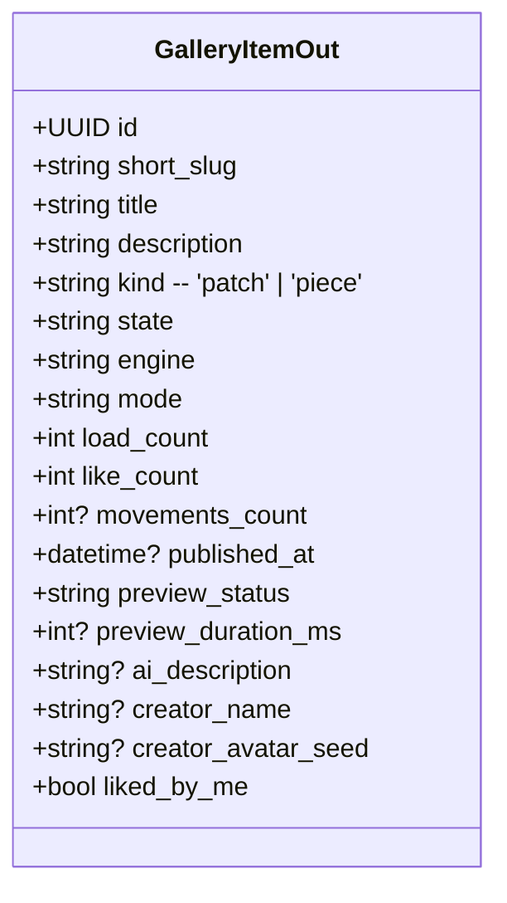
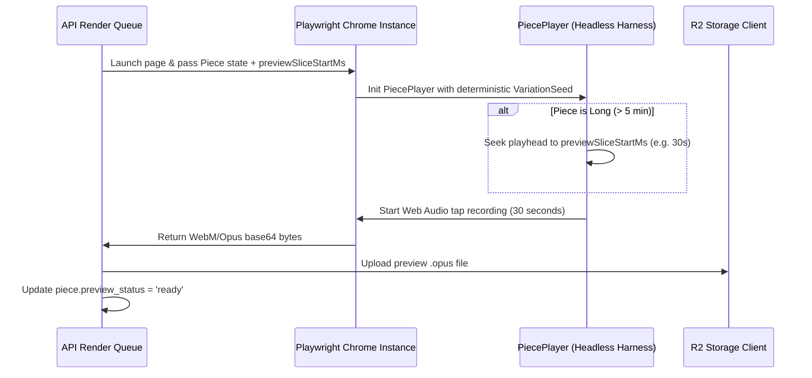

# AnnealMusic v3.7 · Piece-as-Deliverable · CC Implementation Plan

This document outlines the detailed design, database migrations, server-side previews, track-level stem exports, AI prompt templates, collab CRDT configurations, and client UI components required to bring **Pieces** to full first-class parity with **Patches** in AnnealMusic.

---

## 1. Architectural Parity & Unified Gallery Item

To bring Patches and Pieces under a unified gallery model, we will define a single, shared polymorphic abstraction. The gallery list endpoint and the social feed will return items of either kind, discriminated at the root.



### 1.1 Database Schema Unification

We will create a new alembic migration `0010_v3_7_piece_parity.py` to add columns, indexes, and triggers to the `pieces` and `users` tables:

#### Columns Added to `pieces`

- `like_count`: `Integer`, non-nullable, default `0`.
- `load_count`: `Integer`, non-nullable, default `0`.
- `published_at`: `DateTime(timezone=True)`, nullable.
- `preview_status`: `String`, non-nullable, default `'none'` (enum: `'none'`, `'rendering'`, `'ready'`, `'failed'`).
- `preview_storage_key`: `String`, nullable.
- `preview_duration_ms`: `Integer`, nullable.
- `preview_slice_start_ms`: `Integer`, non-nullable, default `30000` (30 seconds, configurable preview starting point).
- `ai_description_embedding`: `VectorType(1536)`, nullable (for semantic similarity).
- `ai_description_source`: `String`, nullable.
- `has_captures`: `Boolean`, non-nullable, default `False`.

#### Columns Added to `users`

- `piece_count`: `Integer`, non-nullable, default `0` (for quota tracking).

#### Quota Defaults

- Add `quota_pieces: int = 100` in `app/config.py` as a separate limit from `quota_patches`.

#### SQLite Triggers

Update database triggers in `api/app/models.py` for local testing so that liking target kind `'piece'` increments `pieces.like_count`.

---

## 2. Keyset Cursor Pagination & Multi-Stream Merging

The `/api/v1/gallery` endpoint will fetch both public patches and public pieces, merging them in-memory and maintaining deterministic keyset cursor pagination across the unified streams.

```python
# Keyset Cursor Merging Algorithm (DESC order)
# 1. Fetch limit + 1 public Patches matching: published_at < cursor_time (tie-break on ID)
# 2. Fetch limit + 1 public Pieces matching: published_at < cursor_time (tie-break on ID)
# 3. Merge, sort by published_at DESC (and ID DESC), slice to target limit.
# 4. Generate next_cursor from the last element in the sliced list.
```

- **Filters**: The "Type" filter will allow querying `both` (default), `patches`, or `pieces`.
- **Dialect Compatibility**: For engine filtering, SQLAlchemy will query the JSONB field safely:
  - Postgres: `Piece.defaults_state["engineId"].astext == engine`
  - SQLite: `func.json_extract(Piece.defaults_state, "$.engineId") == engine`

---

## 3. Server-Side Piece Preview Rendering (Long-Piece Slicing)

Faithful piece rendering runs the real timeline player inside headless Chromium. We extend v0.8's rendering pipeline to support pieces, introducing deterministic variations and long-piece slicing.



### 3.1 Playback Slicing and Detours

We add a public `seek(timeMs: number)` method inside `PiecePlayer.ts` to skip playhead timestamps without firing audio events:

```typescript
seek(timeMs: number): void {
  let currentMs = 0;
  let segIdx = 0;
  this.activeArcRunner = null;

  while (segIdx < this.piece.segments.length) {
    const seg = this.piece.segments[segIdx]!;
    const dur = this.getSegmentDuration(seg);
    if (currentMs + dur > timeMs) {
      this.activeSegmentIdx = segIdx;
      this.playheadMs = timeMs - currentMs;
      this.applyActiveState();
      return;
    }
    currentMs += dur;
    segIdx++;
  }
  // Clamp to end
  this.activeSegmentIdx = this.piece.segments.length - 1;
  const lastSeg = this.piece.segments[this.activeSegmentIdx];
  this.playheadMs = lastSeg ? this.getSegmentDuration(lastSeg) : 0;
  this.applyActiveState();
}
```

### 3.2 Seed Determinism

If `piece.variationSeed` is not defined, `headless.ts` overrides it using a deterministic hash of the piece's title/metadata:

```typescript
const seed =
  piece.variationSeed ?? hashStringToInt(piece.title || 'render-harness-seed');
```

This guarantees that two preview generations for the same piece are completely identical.

---

## 4. Track-Level Stem Export for Pieces

In addition to the unified continuous master mix-down, piece stem exports will generate individual high-fidelity WAV tracks inside the ZIP folder:

1. **`segments.wav`**: The composite core synth/sampler output driven by sequential fixed, arc, and transition segments.
2. **`notation.wav`**: A dedicated track containing only the synth note trigger tones.
3. **`pulse.wav`**: A metronomic click track matching the piece's tempo grid subdivs.
4. **`automation.wav`**: Track-level renders of individual parameter automation curves (user opt-in).

```typescript
// StemTaps extension for pieces
export function getPieceStems(piece: Piece, includeFx: boolean): Stem[] {
  return [
    {
      id: 'master',
      label: 'Master Mix',
      channels: 2,
      isFx: includeFx,
      type: 'master',
    },
    {
      id: 'segments',
      label: 'Timeline Segments',
      channels: 2,
      isFx: false,
      type: 'engine',
    },
    {
      id: 'notation',
      label: 'Notation Notes',
      channels: 1,
      isFx: false,
      type: 'partial',
    },
    {
      id: 'pulse',
      label: 'Pulse Track',
      channels: 1,
      isFx: false,
      type: 'engine',
    },
  ];
}
```

---

## 5. AI Integration: Text-to-Piece & Describe-Piece

We equip the AI router `api/app/routers/ai.py` with custom Claude 3 Haiku prompts and OpenAI embeddings:

### 5.1 Text → Piece Prompt Design

```
You are the AnnealMusic AI Piece Composer. Your role is to translate natural language descriptions of compositions into a structural timeline Piece JSON.

Output format:
{
  "title": "Evocative Title",
  "description": "Short poetic mood card",
  "tempoBpm": 68,
  "segments": [
    { "type": "fixed", "durationMs": 10000, "config": { "params": { "brightness": 0.4 } } },
    { "type": "transition", "durationMs": 5000, "config": { "easing": "easeInOut" } },
    { "type": "arc", "durationMs": 15000, "config": { "arcId": "bell" } }
  ]
}

Constraints:
- Bounded scope: Max 6 segments.
- Do NOT use meta-arcs unless explicitly requested by the user.
```

### 5.2 Describe Piece

poetic, 6-12 word descriptive labels (e.g. _"Drifting mist, slow swells, twilight cathedral"_).

### 5.3 Similar Pieces

Retrieves pieces using OpenAI cosine similarity calculated over `ai_description_embedding` within a distance threshold `< 0.4`.

---

## 6. Real-Time Collaboration CRDT Shape

To prevent CRDT state explosion during dragging automation nodes or notes:

- **Cap**: Enforce the stable 2-person participant limit.
- **Throttling**: Broadcast coordinates locally at 60fps, but throttle Yjs sync updates at `100ms` intervals. Save commits are executed only on `mouseup`.

```typescript
// Throttled Yjs broadcast shape
const syncAutomation = throttle((points: AutomationPoint[]) => {
  sessionConfigMap.set('piece_automation', JSON.stringify(points));
}, 100);
```

---

## 7. URL Schema Version 15

We bump the global schema version to `15`:

- `SCHEMA_VERSION = 15` in `src/share/schema.ts`
- Bounded backward compatibility: Patches at version `7+` and pieces at version `8+` continue to decode correctly by checking the `kind` root keyword.

---

## 8. Retroactive Migration Plan

Saved pieces in the database currently lack previews, embeddings, and descriptions. We introduce a background database task in FastAPI:

- On startup, a sweep runs to identify any public Pieces with `preview_status = 'none'`.
- Enqueues them into the `RenderQueue` and requests description/embedding generation in the background.

---

## 9. Verification & Manual Testing Matrix

- **E2E Smoke Matrix**: Create piece -> add segments, tempo, notation -> publish public -> view in gallery card -> play preview -> export ZIP stems -> join P2P jam session on a piece.
- **Scale Audit**: Test a large piece (60 min timeline, 50 segments, 100+ automation points) inside Chrome to verify smooth 60fps arrangement renders and browser tab stability.
