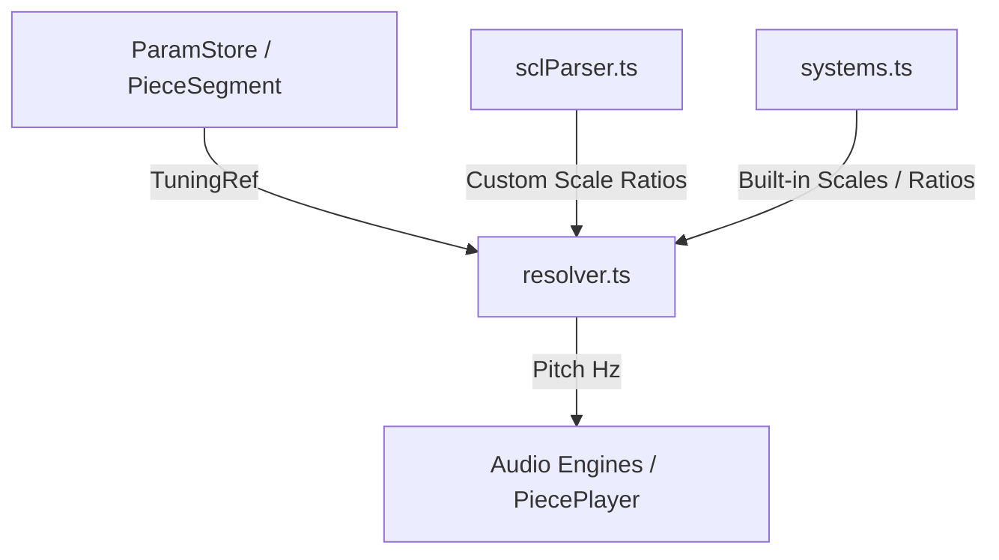

# Implementation Plan - Tuning Systems (v4.1)

We will replace the implicit equal-temperament assumption in the harmonic lattice and notation track with a selectable and extensible **tuning system**. This plan covers all aspects of the architecture, database models, URL serialization, and UI components.

## User Review Required

> [!IMPORTANT]
> **Tuning System Audibility:** Historical and just tunings will sound distinctly "out-of-tune" to ears accustomed to equal temperament. This is expected behavior and a key artistic feature of v4.1.
> **Honest Framing Baseline:** All tunings (especially Solfeggio and 432 Hz) will be accompanied by explicit, honest-framing disclaimers detailing their acoustic characteristics while debunking unverified clinical or healing claims.

## Open Questions

None. The constraints are fully detailed and specified in the CC Mega-Prompt.

---

## Proposed Changes

### 1. Central Tuning Architecture



We will create `src/audio/tuning/` with three core modules:

1. `types.ts`: Interface definitions for tuning systems, references, and structures.
2. `systems.ts`: Scale ratios and lattice mappings for the 10 built-in systems.
3. `resolver.ts`: Pure pitch resolution function for both lattice partials and notation MIDI notes.
4. `sclParser.ts`: Strict Scala (.scl) parser for custom scale imports.

#### Data Structures (`types.ts`)

```typescript
export type TuningSystemId =
  | 'equal'
  | 'just-5'
  | 'just-7'
  | 'pythagorean'
  | 'solfeggio'
  | 'werckmeister3'
  | 'kirnberger3'
  | 'meantone-quarter'
  | 'valotti'
  | 'young'
  | 'custom';

export interface TuningRef {
  system: TuningSystemId;
  sclId?: string; // UUID for custom Scala scale
  referenceA4Hz?: number; // Defaults to 440
}

export interface TuningSystem {
  id: TuningSystemId;
  name: string;
  description: string;
  hasOctaveEquivalence: boolean;
  scaleRatios: number[]; // Chromatic ratios (length 12) starting on Unison=1.0
  getLatticeRatio: (index: number) => number; // Harmonic lattice mapping
}
```

---

### 2. Built-in Tuning Definitions (`systems.ts`)

Each scale's chromatic ratios are defined relative to $C = 1.0$:

- **Equal Temperament:** `scale[i] = 2^(i/12)`
- **Just 5-limit:** `[1/1, 16/15, 9/8, 6/5, 5/4, 4/3, 45/32, 3/2, 8/5, 5/3, 16/9, 15/8]`
- **Just 7-limit:** `[1/1, 15/14, 8/7, 7/6, 5/4, 4/3, 7/5, 3/2, 8/5, 12/7, 7/4, 15/8]`
- **Pythagorean:** `[1/1, 256/243, 9/8, 32/27, 81/64, 4/3, 729/512, 3/2, 128/81, 27/16, 16/9, 243/128]`
- **Werckmeister III (cents):** `[0, 90.23, 192.18, 294.14, 390.23, 498.05, 588.27, 696.09, 792.18, 888.27, 996.09, 1092.18]`
- **Kirnberger III (cents):** `[0, 90.22, 196.09, 294.13, 386.31, 498.05, 590.22, 696.58, 792.18, 889.74, 994.13, 1086.31]`
- **Meantone (quarter-comma cents):** `[0, 75.64, 193.16, 310.26, 386.31, 503.42, 579.47, 696.58, 772.63, 889.74, 1006.84, 1082.89]`
- **Valotti (cents):** `[0, 90.00, 196.00, 294.00, 391.00, 498.00, 590.00, 698.00, 792.00, 895.00, 996.00, 1092.00]`
- **Young (cents):** `[0, 96.10, 202.00, 296.10, 402.00, 500.00, 598.00, 703.90, 800.00, 905.90, 1002.00, 1103.90]`

#### Lattice Mappings (N Partials)

- **Pure Harmonic Series (used by Equal, Solfeggio, Just 5, Just 7):**
  Ratios are exactly `[1.0, 1.5, 2.0, 2.5, 3.0, 4.0, 5.0, 6.0]` (HARMONICS array).
- **Scale-Derived (used by Pythagorean and Historical Westerns):**
  Map the semitone steps corresponding to harmonics `[0, 7, 12, 16, 19, 24, 28, 31]` into the scale:
  `ratio(i) = 2^Math.floor(step/12) * scale[step % 12]`

---

### 3. Solfeggio: Sparse-Pitch Set Mapping

The 9 Solfeggio frequencies are: `[174, 285, 396, 417, 528, 639, 741, 852, 963]`.

- **Root Frequency Snapping:** When Solfeggio is active, any change in `rootFreq` snaps the root to the closest Solfeggio frequency:
  `snappedRoot = SOLFEGGIO_FREQS.reduce((prev, curr) => Math.abs(curr - rootFreq) < Math.abs(prev - rootFreq) ? curr : prev)`
- **Lattice Mapping:** To build a coherent texture without duplicate pitches, we map the N partials to the _other_ 8 frequencies relative to that snapped root:
  `ratio(i) = SOLFEGGIO_FREQS[(r_idx + 1 + i) % 9] / snappedRoot` where `r_idx` is the index of the snapped root.
- **Midi Notes (Notation):** Snap the ET pitch frequency of the MIDI note to the nearest Solfeggio frequency.

---

### 4. Scala (.scl) Parser Spec (`sclParser.ts`)

- Read line by line. Strip trailing whitespace and anything following `!` (comments).
- Skip empty lines and lines starting with `!`.
- The first non-comment line is the description.
- The second non-comment line is the scale size $K$ (integer).
- Collect the next $K$ note lines. Each note line must be:
  - **Cents:** Contains a decimal point (`.`), e.g., `1200.0`. Multiplier is `2^(cents / 1200)`.
  - **Ratio:** Fraction `N/D` (e.g., `3/2`) or integer `N` (e.g., `2`). Multiplier is `N/D`.
- Scale ratios list starts with Unison (`1.0`), followed by the $K$ parsed values. The $K$-th value is the equivalence interval (usually `2.0` / octave).
- **Dynamic Lattice Mapping:** For custom scales, we fit the 8 partials to the closest scale degrees:
  `bestStep = findClosestStep(harmonicRatio)` where step ranges from $0$ to $120$.

---

### 5. URL Schema v17 and State Hydration

We will bump `SCHEMA_VERSION = 17` in `src/share/schema.ts` and add `t.system`, `t.scl_id`, `t.ref_a4` keys.

- **Patches:** Add `t.system`, `t.scl_id`, `t.ref_a4` directly to the parameters state.
- **Pieces / Segments:** Add default tuning under `def.t.*`, and per-segment overrides as `segN.t.system`, `segN.t.scl_id`, `segN.t.ref_a4`.
- **Backward Compatibility:** If `version <= 16`, default tuning loads as `equal`, reference A4 defaults to `440`.

---

### 6. Backend Custom Tunings Store

#### Database Schema (Alembic Migration `0011_v4_1_custom_tunings`)

```python
# Alembic Migration: 0011_v4_1_custom_tunings.py
# down_revision = ("0010_v3_7_piece_parity", "0010_v4_0_listening_sessions")

def upgrade():
    op.create_table(
        "custom_tunings",
        sa.Column("id", GUID(), primary_key=True),
        sa.Column("user_id", GUID(), sa.ForeignKey("users.id", ondelete="CASCADE"), nullable=False),
        sa.Column("name", sa.String(), nullable=False),
        sa.Column("scl_text", sa.String(), nullable=False),
        sa.Column("parsed_scale", JSONType(), nullable=False),
        sa.Column("reference_a4_hz", sa.Numeric(8, 3), nullable=False, server_default="440.0"),
        sa.Column("created_at", sa.DateTime(timezone=True), nullable=False, server_default=sa.func.now()),
    )
    op.create_index("idx_custom_tunings_user", "custom_tunings", ["user_id"])
```

#### Routes (`api/app/routers/custom_tunings.py`)

- `POST /api/v1/custom_tunings` -> Import `.scl` file, parse it, validate, and store.
- `GET /api/v1/custom_tunings` -> List user's custom tunings.
- `DELETE /api/v1/custom_tunings/{id}` -> Delete user's custom tuning.

---

### 7. Audio Engine Integration

The pitch resolution must flow dynamically. We will update `orchestrator.ts` and the engines:

- Pass active `tuning: TuningRef` inside the `SharedParams` configuration.
- In `setSharedParams`, the orchestrator resolves the fundamental frequency of each partial using the resolver.
- **Drift / Detune:** The cents-based detune loop continues to run relative to these resolved pitches.
- **Offline Render / Determinism:** Capture the tuning reference in the render state. The headless offline renderer will resolve identical pitches, ensuring bit-perfect stem exports.

---

### 8. UI Panels and Honest Framing

We will add a new **"Pitch"** sub-panel to settings:

1.  **Tuning Picker:** A clean select dropdown supporting the 10 built-in systems plus imported Scala options.
2.  **More Info Links:** Each tuning has an inline question-mark link opening an educational framing page.
3.  **Reference A4 Input:** Digital slider/input allowing tuning adjustment (e.g. A4 = 432 Hz).
4.  **Scala Scale Management:** Drag-and-drop file target + list of imported scales with delete buttons.

#### Honest Framing Disclaimer Copies

- **Solfeggio:** "These nine frequencies are a modern reconstruction often associated with healing claims. AnnealMusic supports them because they produce a distinct non-octave-equivalent texture. The peer-reviewed evidence for specific clinical effects of these frequencies is absent."
- **432 Hz Reference:** "The claim that 432 Hz possesses unique natural healing or acoustic properties is unsupported by scientific literature. AnnealMusic includes this option because the slight downward pitch shift produces a subtly warmer and different timbre."
- **Historical / Pythagorean:** "Historical Western temperaments give different keys unique 'colors' due to unevenly distributed intervals. They produce beautiful acoustic textures but do not offer targeted physiological or medical benefits."

---

## Verification Plan

### Automated Tests

1.  **Unit Tests (`resolver.test.ts`):**
    - Verify Equal Temperament matches standard formulas exactly.
    - Verify monotonic ascending ratios for all built-in systems.
    - Verify Solfeggio root snapping and correct partial mapping (no duplicate pitches).
2.  **SCL Parser Tests (`sclParser.test.ts`):**
    - Test standard public-domain `.scl` files.
    - Test malformed lines, comment lines, trailing comment lines.
3.  **Backend Integration Tests (`tests/test_custom_tunings.py`):**
    - Test import/parse, list, and delete custom tunings.

### Manual Verification

1.  Verify mid-session tuning switching: audio crossfades smoothly, frequencies shift correctly, visualizer orbits align perfectly.
2.  Verify drag-and-drop `.scl` file uploads correctly and updates the picker.
3.  Verify deterministic stem render matches between live sessions and offline rendering.
