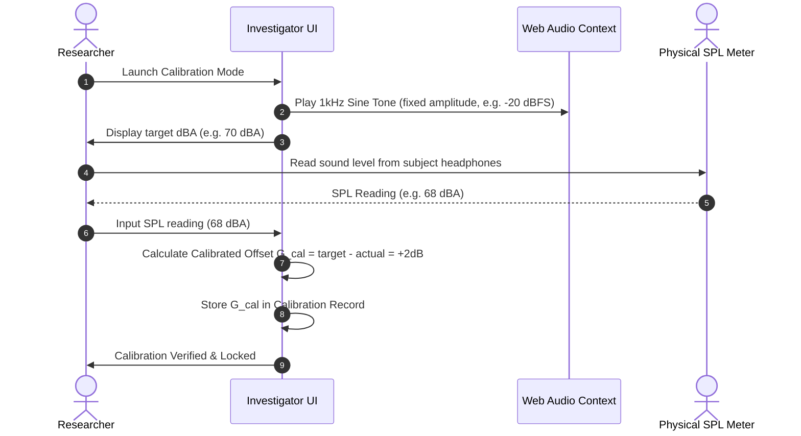
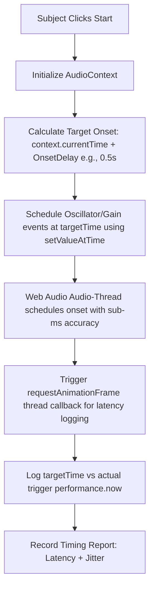

# AnnealMusic v7.2 · Clinical Stimulus-Grade Audio · Project Plan

This document establishes the comprehensive technical specification, database models, API surface, system architecture, and UI/UX design for **AnnealMusic v7.2 (Stimulus-Grade Audio)**.

---

## 1. Goal

Upgrade AnnealMusic's audio presentation system to **clinical-research-grade**. This enables principal investigators (PIs) and clinical researchers to deliver auditory stimuli (patches, pieces, or sonifications) with precise calibration, sub-millisecond time-locked onset scheduling, and cryptographically seeded double-blind/single-blind condition assignment. The framework captures sub-second accurate adverse events, enforces consent/withdraw policies, and generates cryptographic SHA-256 validation hashes of delivered stimuli for scientific post-hoc auditing.

---

## 2. Compliance Posture & Scientific Infrastructure

> [!IMPORTANT]
> **AnnealMusic Regulatory Disclaimer:**
> AnnealMusic is delivered exclusively as **scientific and experimental research infrastructure (I-narrow)**. It is **not** a cleared medical device and does not carry FDA 510(k), PMA, or CE-mark clearances.
>
> 1. **Regulatory Liability:** The Principal Investigator (PI) and their sponsoring institution hold sole and full responsibility for obtaining Institutional Review Board (IRB) approvals, filing Investigational Device Exemptions (IDE) if applicable, and ensuring compliance with human subject research regulations.
> 2. **Infrastructure Integrity:** The platform provides deterministic mathematical execution, calibration protocols, and session audit trails. It does not make diagnostic, therapeutic, or clinical claims about the biological or psychological efficacy of the generated stimuli.
> 3. **Templates Provided:** IRB templates for consent/withdraw processes, standard data formats, and timing limitations are documented in `docs/CLINICAL_DEFAULTS.md`.

---

## 3. Data Model & URL Schema (v22)

### 3.1 Database Migrations (PostgreSQL & SQLite Compatibility)

We will introduce a new migration `0026_v7_2_clinical.py` to create the tables `clinical_protocols` and `clinical_session_records`.

```sql
CREATE TABLE clinical_protocols (
  id                    UUID PRIMARY KEY,
  study_id              UUID NOT NULL REFERENCES studies(id) ON DELETE CASCADE,
  experiment_id         UUID REFERENCES experiments(id),
  conditions            JSONB NOT NULL DEFAULT '[]'::jsonb,
  randomization_scheme  TEXT NOT NULL DEFAULT 'simple',  -- 'simple' | 'latin-square' | 'block-random' | 'custom'
  randomization_seed    TEXT NOT NULL,                  -- cryptographically secure token generated per protocol
  calibration_required  BOOLEAN NOT NULL DEFAULT TRUE,
  target_lufs           NUMERIC(5,2) NOT NULL DEFAULT -23.0,
  adverse_event_capture BOOLEAN NOT NULL DEFAULT TRUE,
  ct_gov_nct            TEXT,                            -- optional ClinicalTrials.gov registry NCT number
  created_at            TIMESTAMPTZ NOT NULL DEFAULT now(),
  updated_at            TIMESTAMPTZ NOT NULL DEFAULT now(),
  CONSTRAINT ck_randomization_scheme CHECK (randomization_scheme IN ('simple', 'latin-square', 'block-random', 'custom'))
);

CREATE TABLE clinical_session_records (
  id                       UUID PRIMARY KEY,
  protocol_id              UUID NOT NULL REFERENCES clinical_protocols(id) ON DELETE CASCADE,
  subject_id               TEXT NOT NULL,               -- researcher-provided subject identifier
  condition_id             TEXT NOT NULL,               -- condition uuid or text index
  started_at               TIMESTAMPTZ NOT NULL,
  completed_at             TIMESTAMPTZ,
  stimulus_sha256          TEXT,                        -- proof of exact delivered waveform parameters
  calibration_record       JSONB,                       -- gain factors + physical SPL meter recordings
  timing_report            JSONB,                       -- Web Audio API sub-ms timing latency and jitter records
  adverse_events           JSONB NOT NULL DEFAULT '[]'::jsonb,
  withdrew                 BOOLEAN NOT NULL DEFAULT FALSE,
  partial_data_disposition TEXT,                        -- 'kept' | 'discarded' (per participant protocol)
  client_audit_log         JSONB NOT NULL DEFAULT '[]'::jsonb -- consent timestamp + withdraw audit trail
);

CREATE INDEX idx_clinical_sessions_protocol ON clinical_session_records(protocol_id, started_at DESC);
CREATE INDEX idx_clinical_protocols_study ON clinical_protocols(study_id);
```

### 3.2 URL Schema (v22)

Shared URLs carrying clinical protocols bump the schema version to `22`.
For the subject runner:
`/clinical/<protocol_slug_or_id>?subject=<subject_id>`

---

## 4. System Design & Architectural Workflows

### 4.1 Calibration Workflow

Stimulus audio levels must be calibrated in LUFS (Loudness Units relative to Full Scale) to guarantee target decibel Sound Pressure Level (SPL) delivery at the subjects' ears.



1. **Volume Scaling:** Subsequent audio playbacks scale the global volume parameter by $10^{(G_{cal}/20)}$ to perfectly achieve target level outputs (with digital clipping safeguards).
2. **Subject Auditory Safeguard:** During runner initialization, subjects listen to a comfort check beep. If they flag it as uncomfortable, the session blocks and requests investigator intervention.

### 4.2 Time-Locked Sub-Millisecond Presentation Strategy

Standard browser JavaScript timers (`setInterval` / `setTimeout`) operate on the main UI thread and are subject to massive latency fluctuations (up to 50–100ms) due to garbage collection or CSS layout tasks. To ensure clinical rigor, we utilize **Web Audio scheduling (`AudioContext.currentTime`)**:



#### Documented Timing Precision Boundaries (`docs/CLINICAL_TIMING.md`)

We will document browser constraints honestly:

- **Audio Thread Latency:** Browser AudioContexts schedule events with sub-millisecond precision internally.
- **Hardware Output Latency:** Actual speaker output suffers from sound card buffer sizes (e.g., 256/512 frames), inducing a hard hardware floor of 5ms–15ms dependent on OS audio drivers.
- **Timing Jitter:** Timing reports compile scheduled onset against actual callbacks to monitor frame deviation.

### 4.3 Condition Randomization Schemes

Cryptographically secure pseudorandom number generators (CSPRNG) prevent investigator or subject selection bias:

1. **Latin Square (Williams Permutation):** Ensures uniform distribution of conditions across subject order, balancing order effects. Mapped via enrollment counter:
   $$\text{assigned\_index} = \text{LatinSquare Williams}(\text{subject\_rank}, N)$$
2. **Block-Randomization:** Randomizes subjects in blocks of sizes $2N$ or $4N$ to maintain balanced treatment sizes at all stages of study collection.
3. **Simple Randomization:** Assigns conditions by hashing:
   $$\text{Hash}(\text{randomization\_seed} + \text{subject\_id}) \pmod N$$

The enrollment process resides strictly backend side (`POST /api/v1/clinical-protocols/:id/enroll`) returning the assigned `condition_id` to double-blind investigators. Masking controls on the Studies panel allow PI accounts to toggle condition names between unmasked and masked formats.

### 4.4 Stimulus Integrity SHA-256 Verification

To guarantee that the stimulus delivered to the subject matches the researcher's configuration exactly, the client-side runner executes a SHA-256 digest on the canonical JSON string of the assigned condition's patch/piece/sonification parameters.

In addition, if offline rendering is utilized to compile the audio stem:

1. The PCM float channel arrays of the rendered offline buffer are packed.
2. An incremental SHA-256 hashing digest is calculated over the buffer bytes.
3. The resulting SHA-256 hash is recorded inside the session record's `stimulus_sha256` column.
4. Researchers can post-hoc re-verify that the exact sample-accurate stimulus was rendered.

### 4.5 Adverse-Event capture UX

An always-present, visually isolated crimson button reads "Report an issue" during the subject runner.

- **Execution:** Clicking pauses the stimulus instantly.
- **Form:** Participant or researcher describes the event (e.g. anxiety, ringing, headache).
- **Sub-Second Logging:** The event maps to the sub-second-accurate session time, recording `elapsed_ms` since audio start and absolute ISO timestamp.
- **Output:** Stored directly inside the `adverse_events` JSON array in `clinical_session_records`.

### 4.6 Withdraw Policy ("Withdraw is Real")

If a subject clicks "End participation":

1. Playback halts immediately.
2. The UI presents an IRB-compliant choice:
   - **Discard Entirely:** The backend completely drops all response CSV and datalogger JSONL entries, keeping only the signed consent/withdraw audit trail (`partial_data_disposition = 'discarded'`).
   - **Retain Partial Data:** Keeps completed trials up to the withdraw mark (`partial_data_disposition = 'kept'`).

---

## 5. UI/UX Interface Design

### 5.1 Investigator Interface (Studies Panel extensions)

- **Protocol Editor tab** in the Studies Dashboard:
  - Add condition slots: pick stimulus reference (Patch/Piece/Sonification) + Version.
  - Set Randomization Scheme + Target LUFS level.
  - Toggle Masking (Single-blind / Double-blind toggles to cover/uncover Condition mapping IDs in lists).
- **Live Session Dashboard:**
  - Real-time subject enrollment counters.
  - Interactive distribution bar charts showing active enrollment balanced counts.
  - Adverse events feed showing timestamps, descriptors, and condition (masked or unmasked).
  - Pre-session Calibration Dialog.

### 5.2 Subject Interface (Minimal, calm, clinical aesthetic)

Accessible at `/clinical/<protocol_slug>?subject=<id>`

- Removed all main site navigations, headers, and footer links.
- Sleek, premium dark/glassmorphic interface using standard dark stone colors and warm amber accents.
- Modern fonts (Outfit / Inter) with clean layouts.
- **Workflow:**
  1. **Consent Screen:** Displays ethics statements, study abstract, and IRB clinical trial registries (NCT number).
  2. **Calibration Screen:** Prompts subject to wear headphones, plays short auditory comfort beeps to test volume.
  3. **Stimulus Screen:** Full-width focus layout, optional visual breathing indicator (if configured), countdown timer. "Report an issue" and "End participation" always accessible.
  4. **Response Survey Screen:** Minimalistic input widgets (Continuous sliders, Likert scales, or multiple-choice questions) matching the Experiment Definition.
  5. **Debrief / End Screen:** Confirms data upload status or provides ZIP download export link.

---

## 6. Proposed Changes

We will group modifications by backend and frontend.

### 6.1 Backend Changes (Python / FastAPI)

#### [NEW] [0026_v7_2_clinical.py](file:///Users/averykarlin/annealMusic/api/alembic/versions/0026_v7_2_clinical.py)

Alembic migration creating `clinical_protocols` and `clinical_session_records` tables with all columns, indices, and constraints.

#### [MODIFY] [models.py](file:///Users/averykarlin/annealMusic/api/app/models.py)

Register SQLAlchemy models: `ClinicalProtocol` and `ClinicalSessionRecord`.

#### [MODIFY] [schemas.py](file:///Users/averykarlin/annealMusic/api/app/schemas.py)

Pydantic schemas for serialization and request validations:

- `ClinicalProtocolCreate`, `ClinicalProtocolUpdate`, `ClinicalProtocolOut`
- `ClinicalSessionRecordEnroll`, `ClinicalSessionRecordOut`, `ClinicalSessionRecordCreate`
- `CalibrationRecordSchema`, `TimingReportSchema`, `AdverseEventSchema`

#### [NEW] [randomization.py](file:///Users/averykarlin/annealMusic/api/app/services/randomization.py)

Implements:

- Simple CSPRNG hash randomization
- Williams Latin Square matrix row mapping
- Permuted Block generator (e.g. block size 4, 8)

#### [NEW] [clinical.py](file:///Users/averykarlin/annealMusic/api/app/routers/clinical.py)

FastAPI router registering:

- `POST /api/v1/clinical-protocols`
- `GET /api/v1/clinical-protocols/:id`
- `PATCH /api/v1/clinical-protocols/:id`
- `DELETE /api/v1/clinical-protocols/:id`
- `POST /api/v1/clinical-protocols/:id/enroll` (Subject enrollment, CSPRNG condition mapping)
- `POST /api/v1/clinical-session-records` (Write final metadata, response and datalogger logs)
- `GET /api/v1/clinical-session-records/:id`
- `POST /api/v1/clinical-protocols/:id/calibrate`
- `GET /api/v1/clinical-protocols/:id/calibration-history`

#### [MODIFY] [main.py](file:///Users/averykarlin/annealMusic/api/app/main.py)

Include the new `clinical.router`.

### 6.2 Frontend Changes (React / TypeScript)

#### [NEW] [types.ts](file:///Users/averykarlin/annealMusic/src/clinical/types.ts)

TypeScript interfaces matching database structures, randomization states, calibration, and timing reports.

#### [NEW] [api.ts](file:///Users/averykarlin/annealMusic/src/clinical/api.ts)

Fetch client handlers covering `/api/v1/clinical-protocols/*` and `/api/v1/clinical-session-records/*` endpoints.

#### [NEW] [ProtocolEditor.tsx](file:///Users/averykarlin/annealMusic/src/clinical/ProtocolEditor.tsx)

The researcher's condition mapping sheet and randomization setup tab integrated into the Studies panel.

#### [NEW] [CalibrationDialog.tsx](file:///Users/averykarlin/annealMusic/src/clinical/CalibrationDialog.tsx)

SPL meter manual calibration alignment tool.

#### [NEW] [SubjectRunner.tsx](file:///Users/averykarlin/annealMusic/src/clinical/SubjectRunner.tsx)

The participant study player managing sequence flows (Consent -> Headphone Check -> Stimulus -> Survey -> Debrief).

#### [NEW] [AdverseEventDialog.tsx](file:///Users/averykarlin/annealMusic/src/clinical/AdverseEventDialog.tsx)

Overlay capturing participant discomfort logs.

#### [MODIFY] [main.tsx](file:///Users/averykarlin/annealMusic/src/main.tsx)

Register clinical route path:
`<Route path="/clinical/:slug" element={<SubjectRunner />} />`

---

## 7. Verification & Testing Plan

### 7.1 Automated Backend Tests (`api/tests/test_clinical.py`)

We will create a comprehensive Pytest test suite asserting:

1. **CRUD Operations:** Verified role-based permissions (viewer, PI, co-investigator) on clinical protocol creations.
2. **CSPRNG Randomization:** Deterministic seeds mapping to proper Latin square distributions. Enroll 6 subjects over 3 conditions; assert equal balanced distribution.
3. **Enrollment Boundary:** Ensure subjects can only enroll when study status is `'active'` or `'data-collection'`.
4. **Adverse Event Logging:** Validating sub-second logging payloads map correctly.
5. **Withdraw Disposition:** Confirming that setting `'discarded'` completely zeroes out the CSV and datalogger inputs while retaining investigator audit trails.

### 7.2 Manual & End-to-End Verification

Using the clinical interface, we will execute a complete smoke matrix:

1. Create a clinical protocol linked to an active study with 3 conditions (Latin square).
2. Enroll 6 participants using `/clinical/<protocol_slug>?subject=sub-X`.
3. Complete the physical SPL calibration on the investigator page.
4. Run the subject flow, checking headphone audio beeps.
5. Trigger a mock adverse event mid-play on participant 3; write details and continue.
6. Trigger a full withdraw on participant 4, selecting "discard data"; assert only the consent/withdraw audit record remains.
7. Verify that data exports zip bundles match definitions perfectly.

---

## 8. Open Questions & Design Feedback

> [!IMPORTANT]
> **Open Question 1:**
> Does the protocol design require supporting **adaptive trial designs** (where the next condition selected depends dynamically on responses collected from prior participants) or can we stick strictly to static a-priori CSPRNG randomization?
> _Recommendation:_ Keep adaptive design deferred to v7.3 to maintain robust and stable block/Latin-square scheduling during initial rollout.
>
> **Open Question 2:**
> For double-blind studies, should investigator accounts be physically blocked from loading the unmasked condition IDs altogether during data collection, or is simple masking toggling on the dashboard sufficient?
> _Recommendation:_ Toggling is standard for investigator debugging. We will provide a simple masked default overlay with role-based restrictions. pi-level accounts can bypass masking with a warning log recorded in the audit trail.
