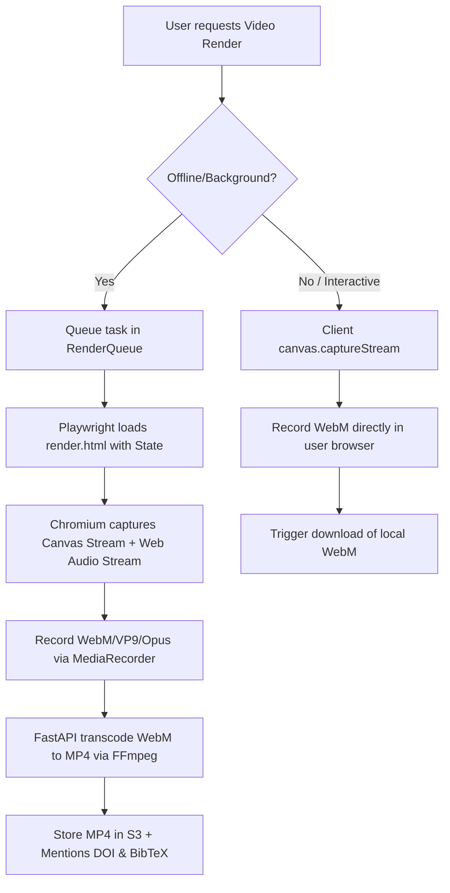

# Scientific Communication Tools Plan (v7.6)

This plan outlines the architecture, data models, rendering pipelines, and embed surfaces for making AnnealMusic outputs publishable, accessible, and presentation-ready.

---

## 1. Video Render Pipeline

The rendering system provides high-fidelity, synchronized video exports (combining audio and visualizer frames) both in the background (headless/server-side) and interactively (client-side).



### Server-Side (Offline) Render

- **Harness Extension**: We extend `src/render/headless.ts` to support offscreen/headless canvas rendering. Playwright sets viewport sizes to match the requested resolution:
  - **1080p** (1920x1080)
  - **4K** (3840x2160)
  - **720p Square** (720x720) for Twitter/social platforms.
- **Capture Technique**:
  - The headless browser calls `canvas.captureStream(30)` or `canvas.captureStream(60)` to get the visual track.
  - The audio track is captured from the `Orchestrator`'s post-FX `MediaStreamAudioDestinationNode`.
  - A browser `MediaRecorder` runs concurrently with the audio/visual performance, recording a `.webm` file.
  - The base64-encoded WebM is sent back to the Python FastAPI server.
- **FFmpeg Transcode**:
  - The Python server saves the WebM to a temporary file.
  - We execute `ffmpeg` to transcode the video into a standard H.264 video with AAC audio inside an MP4 wrapper, ensuring universal compatibility across journals and PDFs:
    ```bash
    ffmpeg -i input.webm -c:v libx264 -preset fast -crf 22 -c:a aac -b:a 192k -pix_fmt yuv420p output.mp4
    ```
  - The resulting `.mp4` file is stored in S3/Firebase Storage under `renders/<render_id>.mp4`.

### Client-Side (Interactive) Render

- Uses the identical `MediaRecorder` approach inside the active browser tab.
- Mounts a lightweight overlay to show recording progress.
- Triggers a direct download of the recorded WebM file.

---

## 2. Embed Figure Widget Design & Bundle Size Budget

To be eligible for inline embedding in online scientific journals, `/embed-figure/:slugOrId` must be extremely lightweight, loading quickly on any 3rd-party paper page.

### Bundle Size Constraint: < 30 KB (Gzipped)

- **Zero React / Zero Tailwind**: Implementing in plain Vanilla TypeScript (`src/embed/EmbedFigureApp.tsx` or `.ts` bundle).
- Minimal inline-styled components.
- Direct standard HTML/CSS structure to minimize JS footprint.

### Minimal Player Design

- **Single-row/compact layouts** displaying:
  - Play/Pause button.
  - Dynamic scrub bar with standard timer (current time / duration).
  - Title, author, version, and license (CC-BY).
  - Low-profile citation trigger button.
- **Aesthetics**: HARMONIOUS Glassmorphism, smooth hover micro-animations, adaptive journal styling.
- **Color Customization**: Researchers can customize background, foreground, and accent colors to match specific journal stylesheets via query parameters:
  ```
  /embed-figure/<id>?theme=light&bg=ffffff&fg=333333&accent=10b981
  ```

---

## 3. Citation Infrastructure Extensions

Every renderable artifact (patch, piece, sonification, listening session) must carry appropriate academic attribution metadata.

- **BibTeX Generation**: Extends `api/app/services/citation.py` to generate complete, standard BibTeX records for individual sonifications and listening sessions.
- **Zenodo DOI Minting**: If the rendering belongs to a study with a minted DOI (e.g. through the Zenodo integration in v7.0/v7.5), it automatically retrieves and embeds the study DOI.
- **Reference Sidecar**: When a researcher downloads a render bundle, the `.mp4` or `.png` is accompanied by a `.bib` file mapping exactly to the reference citation.

---

## 4. Accessibility & Sonification Descriptions

Since sonifications translate data into sound, they are uniquely positioned as accessibility tools. We implement several dedicated layers to ensure blind/low-vision researchers are fully included.

### Accessibility Schema

```sql
CREATE TABLE accessibility_descriptions (
  artifact_kind   TEXT NOT NULL,                     -- 'patch' | 'piece' | 'sonification' | 'listening_session'
  artifact_id     UUID NOT NULL,
  description     TEXT NOT NULL,
  language        TEXT NOT NULL DEFAULT 'en',
  source          TEXT NOT NULL,                      -- 'auto' | 'manual' | 'reviewed'
  updated_at      TIMESTAMPTZ NOT NULL DEFAULT now(),
  PRIMARY KEY (artifact_kind, artifact_id, language)
);
```

### Auto-Generation of Descriptions

- For canonical sonification mappings (e.g., standard physics or spectral models), the backend parses the `mapping_spec` and generates a descriptive explanation:
  _Example_: _"A time-series sonification mapping continuous temperature data to frequency (220Hz to 880Hz) and humidity data to granular density. Emergent order param r(t) represents sync phase."_
- PIs can customize or manually override these descriptions using a secure React `AccessibilityEditor` component.

### Interactive Accessibility Layers

- **Screen Reader Compatibility**: The `/embed-figure` route will declare appropriate `aria-live`, `aria-describedby`, and keypress triggers. Focus on the wordmark or visualizer area reads the full text description.
- **Tactile Playback**: Mobile haptics vibrate based on significant sonification triggers (e.g., Kuramoto order spikes or bell schedules), using the Capacitor Haptics API on mobile, and `navigator.vibrate` on Web.
- **Tempo Control**: A playback rate selector (0.5x, 0.75x, 1x, 1.5x, 2x) adjusts the speed of both audio playback (`AudioContext` or audio buffer speeds) and visualization coordinate progression.
- **High-Contrast Visualization Mode**: A selectable mode with high contrast ratios (> 7:1) using vibrant, stark color palettes for low-vision researchers.

---

## 5. Outreach Cards

Packaged bundles built to make sonification research shareable on social media, conference announcements, and abstracts.

- **Layout Structure**:
  - 15-30s audio excerpt.
  - Still thumbnail + looped video preview.
  - Pinned DOI + BibTeX citation link.
  - Short one-paragraph summary.
  - Default CC-BY license.
- **Open Graph Support**: Dynamic server-rendered HTML tags (`og:image`, `og:video`, `twitter:card`) so pasting the outreach card link on Twitter/X or Slack renders the rich preview.

---

## 6. Talk Presentation Mode

For live projections at conferences (ICAD, NIME, AES, etc.), we provide a dedicated presenter mode.

- **Distraction-Free Layout**: Route `/talk/:slugOrId` renders in full-screen. No buttons, sidebars, or headers are visible on-screen.
- **Keypress / Hover Controls**: Slide controls appear only when the mouse hovers over the footer or upon pressing spacebar/arrows.
- **Embedded Audio Backup**: Unreliable conference Wi-Fi is a known failure mode. The talk mode page includes the pre-rendered audio asset embedded as a fallback in the client cache so playback remains completely local and robust.

---

## 7. Module & File Layout

```
api/
├── app/
│   ├── models.py                     # [MODIFY] Add RenderedArtifact + AccessibilityDescription models
│   ├── schemas.py                    # [MODIFY] Add RenderedArtifactOut + AccessibilityDescription schemas
│   ├── routers/
│   │   ├── renders.py                # [NEW] POST /renders/image, POST /renders/video, GET /renders/:id
│   │   └── accessibility.py          # [NEW] POST, GET endpoints for descriptions
│   └── services/
│       └── video_render.py           # [NEW] Playwright harness controller + FFmpeg subprocess wrapper
docs/
├── v7.6-PLAN.md                      # [NEW] Checkpoint 0 Plan
├── PUBLISHING.md                     # [NEW] Documentation for researchers on embedding
└── ACCESSIBILITY.md                  # [NEW] Documentation on accessibility surfaces
src/
├── communications/
│   ├── RenderDialog.tsx              # Still Image/Video rendering modal
│   ├── VideoRenderQueue.tsx          # Real-time task tracker for background exports
│   ├── OutreachCardBuilder.tsx       # Outreach card customization form
│   └── AccessibilityEditor.tsx      # PI-curated transcript interface
├── embed/
│   ├── EmbedFigureApp.tsx            # Optimized Vanilla embed-figure app (<30KB)
│   ├── TalkApp.tsx                   # Presenter talk mode interface
│   └── embedEntry.ts                 # [MODIFY] Entry points for embed, embed-figure, and talk
```

---

## 8. Risks & Mitigations

- **Video Render Cost**: Heavy video conversions can block the Python process and consume massive CPU resources.
  - _Mitigation_: Render queue enforces low concurrency (default = 1), using Python `asyncio` subprocess calls for FFmpeg so rendering remains entirely non-blocking.
- **Embed Figure Widget Size**: Modern bundlers easily pull in deep dependencies (e.g. Tone.js or React), exceeding the 30 KB budget.
  - _Mitigation_: Embed bundle is strict Vanilla JS with zero external dependencies. The CI bundle-size gate checks `assets/embed.js` to ensure the size budget is never breached.
- **Transcript Accuracy**: Automated descriptions might sound generic.
  - _Mitigation_: Standard auto-generated texts are strictly marked as `source='auto'`, and the UI prompts PIs with a prominent notice to "Review and Edit accessibility transcripts before publishing."
