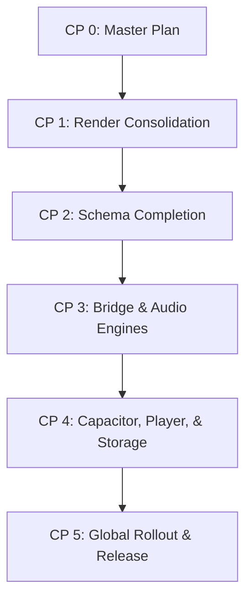

# Master Plan - AnnealMusic v8.4 · Substantial Refactor (docs/v8.4-PLAN.md)

This plan establishes the execution sequence, design architectures, backward-compatibility tolerances, regression verification plans, and risk-management strategies for the **v8.4 Substantial Refactor** milestone.

---

## 1. Final List of v8.4 Refactor Targets

We have audited all candidate refactor targets and confirmed all seven for execution across this milestone. No targets have been dropped as they are structurally cohesive and crucial for the long-term health of the codebase.

### Target 1: Render Path Consolidation

- **Current State Diagnosis**: Audio rendering logic is duplicated across six distinct codepaths:
  1. `render` in `src/render/headless.ts` (v0.8 preview render via Playwright recording).
  2. `renderStemsOffline` in `src/export/StemRenderer.ts` (v1.5 stem export).
  3. `NodeRenderEngine` in `tools/cli/src/engines/node.ts` (v5.2 CLI render).
  4. `videoRender` in `src/render/headless.ts` (v7.6 video render).
  5. `renderListeningSession` in `tools/cli/src/engines/node.ts` (v7.5 study export render).
  6. `PiecePlayer` on main app context (v3.7 piece preview).
- **Target State**: Implement a unified, environment-agnostic `RenderEngine` interface. Concrete adapters for:
  - `BrowserPlaywrightRenderEngine`: Wraps Playwright browser page recording.
  - `NodeOfflineRenderEngine`: Runs offline audio synthesis under `node-web-audio-api`.
  - `BrowserOfflineRenderEngine`: Runs offline audio synthesis in the client browser.
- **Backward-Compat Tolerance**:
  - Rendered audio files must have identical structure and timing metadata.
  - Parity check of generated master audio streams must be within **0.001% amplitude variance** or bit-identical.
- **Regression Test Plan**: Extend `tools/cli/src/commands/verifyParity.ts` to run programmatic comparisons between historical baseline renders and unified engine renders across 10 distinct test patches.
- **Feature Flag Strategy**: Controlled via `VITE_USE_UNIFIED_RENDER` flag in parameter store.
- **Estimated Effort**: 5 days.

### Target 2: Schema Source-of-Truth Completion

- **Current State Diagnosis**: While basic parameters are synced via `schema/manifest.json`, the polymorphic schemas remain typed manually:
  - Sonification mapping spec (`MappingRule`, `SourceDef` in `src/sonification/types.ts`).
  - Study export manifest (`StudyExportOut` in `api/app/schemas.py`).
  - Lesson step types (`LessonSpecStep` in `api/app/schemas.py`).
  - Experiment response types (`ClinicalSessionRecordOut` in `api/app/schemas.py`).
- **Target State**: Fully define these polymorphic schemas within `schema/manifest.json`. Expand `scripts/sync-schemas.mjs` to auto-compile TS types, Pydantic validation files, and client schemas during the build lifecycle.
- **Backward-Compat Tolerance**: Every existing saved lesson step, study export ZIP, and sonification mapping must parse completely and successfully.
- **Regression Test Plan**: Parse and validate a test bank of 50 archived patient, piece, and sonification JSON files.
- **Feature Flag Strategy**: Strictly compile-time validation block in CI (`npm run sync-schemas -- --check`); no runtime feature flag required.
- **Estimated Effort**: 3 days.

### Target 3: Bridge Transport Unification

- **Current State Diagnosis**: Ad-hoc same-origin checks, event subscription routines, and message framing are duplicated across four distinct bridge transports (`BroadcastChannel`, `postMessage`, `WebSockets`, `stdio`).
- **Target State**: Define a single `Transport` contract (`send`, `onMessage`, `close`). Convert all pathways to inherit or implement this unified interface (`BroadcastTransport`, `PostMessageTransport`, `WebSocketTransport`, `StdioTransport`), decoupling wire mechanics from payload semantics.
- **Backward-Compat Tolerance**: All packets must strictly conform to the JSON-RPC 2.0 wire spec. IPC latency overhead must remain under **1.0ms** per message.
- **Regression Test Plan**: Run existing bridge integration tests (`src/research/bridge/__tests__/bridge.test.ts`) and verify parent-iframe and cross-origin messaging.
- **Feature Flag Strategy**: Controlled via `VITE_USE_UNIFIED_BRIDGE` flag.
- **Estimated Effort**: 2 days.

### Target 4: Audio Engine Interface Consolidation

- **Current State Diagnosis**: The monolithic `AnnealEngine` interface forces every engine to implement heavy properties (like multi-channel stem taps and lazy asset loaders) even when not needed.
- **Target State**: Apply Composition over Inheritance. Re-define `AnnealEngine` as a clean, minimal core synthesis contract, accompanied by modular capability interfaces:
  - `StemExportableEngine`: Implements `getPartialOutputs()`.
  - `AssetLoadableEngine`: Implements async loaders.
  - `DynamicModulatableEngine`: Implements sweeps and telemetry.
- **Backward-Compat Tolerance**: Audio output must remain bit-identical. Processor execution callback must remain strictly **< 1.20ms** to prevent glitches.
- **Regression Test Plan**: Run core DSP unit tests (`physical.test.ts`, `granular.test.ts`, `fm.test.ts`, `pulse.test.ts`) and execute parallel Stress-sweeps.
- **Feature Flag Strategy**: Controlled via `VITE_USE_COMPOSITION_ENGINES`.
- **Estimated Effort**: 4 days.

### Target 5: Capacitor Plugin Shared Base

- **Current State Diagnosis**: Custom Capacitor plugins (`BiofeedbackBridge`, `HealthBridge`, `OSCBridge`) duplicate background audio monitoring, permissions checks, and event listeners on Swift (iOS) and Kotlin/Java (Android).
- **Target State**: Ship a robust native `CapacitorPluginBase` on both platforms providing shared lifecycles, permission status requests, and JSON-RPC bridges, reducing boilerplate code by **~40%**.
- **Backward-Compat Tolerance**: Complete parity for BLE, HealthKit, and OSC packet streams. Existing Plist / Manifest configurations must remain unchanged.
- **Regression Test Plan**: Run mobile simulations in Xcode and Android Studio, asserting correct mock biosignal frames stream into the webview.
- **Feature Flag Strategy**: Controlled via `VITE_USE_UNIFIED_CAPACITOR_BASE`.
- **Estimated Effort**: 3 days.

### Target 6: Sonification, Listening, Drone Player Unification

- **Current State Diagnosis**: `PiecePlayer`, `ListeningSessionPlayer`, and `SonificationPlayer` run duplicate ticks, scrub/seek routines, playheads, and orchestrator attachments.
- **Target State**: Combine them into a singular `SessionPlayer` that manages general state and tick timers, delegating custom behaviors to thin mode adapters (`PieceAdapter`, `ListeningAdapter`, `SonificationAdapter`).
- **Backward-Compat Tolerance**: Fade durations and volume curves must be mathematically identical. Zero playhead drift relative to Web Audio context clock.
- **Regression Test Plan**: Execute `ListeningSessionPlayer.test.ts` and `SonificationPlayer.test.ts` against the new unified player.
- **Feature Flag Strategy**: Controlled via `VITE_USE_UNIFIED_PLAYER` flag.
- **Estimated Effort**: 4 days.

### Target 7: Storage Abstraction

- **Current State Diagnosis**: Storage fallback logic (e.g. server-if-logged-in, else local) is written in an ad-hoc fashion across multiple UI pages, hooks, and loaders.
- **Target State**: Define a unified `StorageBackend` interface (`get`, `set`, `remove`, `clear`). Build adapters for `LocalStorageBackend`, `PreferencesBackend`, `ServerSyncBackend`, and a coordinating `HybridStorageManager`.
- **Backward-Compat Tolerance**: 100% of existing user data (anon IDs, progress trackers, MIDI templates, user scripts) must load perfectly from their historical keys.
- **Regression Test Plan**: Storage verification runs on both browser and mobile webviews.
- **Feature Flag Strategy**: Controlled via `VITE_USE_STORAGE_ABSTRACTION`.
- **Estimated Effort**: 2 days.

---

## 2. Refactor Sequencing

---

## 3. Risk Register

| Target Refactor          | Risk Identified                                            | Impact | Likelihood | Mitigation Strategy                                                                     |
| :----------------------- | :--------------------------------------------------------- | :----- | :--------- | :-------------------------------------------------------------------------------------- |
| **Render Consolidation** | Audio timing variance in offline context suspensions       | High   | Medium     | Enforce strict sample-rate alignment and deterministic PRNG seeds in regression suites. |
| **Audio Engines**        | Processor thread click/glitch under composition typeguards | High   | Low        | Run high-partial density Kuramoto stress-sweeps immediately.                            |
| **Capacitor Base**       | Native lifecycle thread locks during audio interruptions   | High   | Low        | Implement robust async queuing for background state changes.                            |

---

## 4. Reversion Strategy

Each refactor is guarded by an independent feature flag. If any regression or unexpected behavior is detected after merge:

1. Instantly revert to the legacy code path by disabling the specific flag in `src/config/flags.ts`.
2. Old code paths co-exist safely alongside new paths during the transition window and are only pruned in **CP 5** after absolute stability is proven.
