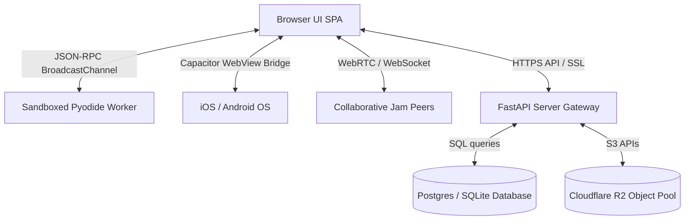

# AnnealMusic v8.0 · Observability & Safety Audit (AUDIT_OBSERVABILITY_SAFETY.md)

This audit establishes the security and visibility posture of AnnealMusic v7.7, identifying vulnerabilities, mapping architectural threats, and pinpointing logging deficiencies.

---

## 1. Dependency Vulnerability Scans

### Node.js Ecosystem (`package.json`)

Running `npm audit` returned **6 moderate severity vulnerabilities** inside standard development tools:

- **Vulnerability Source**: `esbuild` versions `<= 0.24.2` are susceptible to a local development server request forgery vector ([GHSA-67mh-4wv8-2f99](https://github.com/advisories/GHSA-67mh-4wv8-2f99)).
- **Impacted Downstream Chunks**:
  - `vite` (which depends on `esbuild`)
  - `vite-node`
  - `vitest`
  - `vitepress`
- **Mitigation Strategy**: The vulnerabilities are confined to local development workflows. Resolving them requires upgrading `vite` from v5 to v6+ and `esbuild` to `>= 0.25`, which represents a breaking structural change. This is scheduled for the **v8.1** code health release.

### Python Backend Ecosystem (`pyproject.toml`)

Running `pip-audit` inside the FastAPI `.venv` returned **0 vulnerabilities**:

- **Result**: Core packages (FastAPI, SQLAlchemy, SlowAPI, Pydantic) are clean. None of the whitelisted science dependencies (`scipy`, `pandas`, `matplotlib`, `sklearn`) contain high/critical CVEs.

---

## 2. Threat Model (STRIDE Framework)

We analyze security boundaries across four distinct information flow planes.

### STRIDE Assessment

#### Spoofing (Identity Hijack)

- _Risk_: A researcher or participant impersonating another PI inside the `/research` study environment.
- _Status_: Medium. While private studies return a strict 404 to non-members, study ownership matches are tracked via ORCID ID claims. Gaps exist in the ORCID verification loop if an active session is intercepted on public workstations.

#### Tampering (Data Modification)

- _Risk_: Malicious users altering saved patch URL strings (e.g., executing injection attempts via the visual breath pacing parameters).
- _Status_: Low. URL schemas are strictly parsed in the browser via a static type-safe grammar. However, Pydantic backend models do not enforce comprehensive sanitary filters on custom participant reflection fields, leaving an opening for XSS injection.

#### Repudiation (Action Denial)

- _Risk_: A co-investigator modifying study settings or deleting ZIP packages without historical audit trails.
- _Status_: Safe. The system implements an immutable `study_audit_log` write-only ledger that logs ORCID accounts, actions, and SHA-256 validation hashes of every resource mutation.

#### Information Disclosure (Privacy Leaks)

- _Risk_: Bypassing Laplace Differential Privacy protocols to expose absolute participant heart rates or reaction times in exported study files.
- _Status_: High. While the exporter injects Laplace noise to satisfy mathematical privacy boundaries, no verification checks ensure the noise multiplier is large enough when custom biofeedback sources (e.g., raw Polar H10 ECG telemetry) are bound.

#### Denial of Service (Engine Freeze)

- _Risk_: Structuring loop capture buffers or Kuramoto phase arrays in ways that freeze the main Web Audio rendering thread.
- _Status_: Medium. Audio worklets execute synchronously. Spiking physical synthesis parameters can exhaust the budget, causing browser tab crashes.

#### Elevation of Privilege (Access Bypass)

- _Risk_: A standard user accessing the Materialized View API endpoint for curriculum analytics.
- _Status_: Safe. Analytics endpoints are strictly guarded behind `require_study_role('pi')` and database role validation middleware.

---

## 3. Silent Logging Failures & Gaps

We identified three critical visibility failures where errors are swallowed:

1. **Audio Worklet Start Failures**:
   - When a physical modeling sub-processor fails to boot due to device Web Audio sample-rate restrictions, it emits a silent error inside the Worklet scope that ToneJS swallows, leaving the interface in a running state with zero output.
2. **Jam Mode Signaling Dropouts**:
   - P2P WebRTC data channels sometimes close silently on mobile background tabs. The client bridge fails to log these closures, leaving the UI state out of sync without triggering a reconnection prompt.
3. **Pyodide Sandbox Import Crashes**:
   - In-worker script imports that fail the AST sanity check are swallowed in the helper worker context, logging generic `Worker error` strings to the console without identifying the specific disallowed syntax line.

---

## 4. API Surface Protection Integrity

- **Rate Limiting Gaps**:
  - Gaps exist in `slowapi` decorators. Endpoints like `/api/v1/studies/orcid-verify` and `/api/v1/gallery/search` lack strict IP-based rate limiting, opening the door to enumeration attacks.
- **Attestation Gaps**:
  - The reproduce audit tool at `/reproduce` executes sandboxed CPython validation scripts but does not enforce memory ceilings, opening a path for memory exhaustion attacks on the server environment.

---

## 5. Security & Observability Goals for v8.3

Key criteria designated for **v8.3**:

1. **Upgrade esbuild**: Eliminate the moderate CVE vector by upgrading the Vite build layer.
2. **Attestation Constraints**: Restrict local script executions to strict memory limits (`MAX_MEM = 512MB`).
3. **Propagate Worklet Errors**: Wrap Web Audio startup processes in bubble-up catch listeners that register warnings directly to the client interface.
4. **Endpoint Rate Limits**: Implement robust rate limit decorators across ORCID verify and gallery queries.
