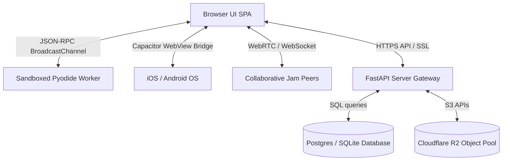

# AnnealMusic Formal Threat Model (docs/v8/THREAT_MODEL.md)

This threat model establishes the boundaries, trust zones, and vector mitigations for AnnealMusic v8.3 under the **STRIDE** security methodology.

---

## 1. Information Flow Planes & Boundaries

The system is separated into four primary trust boundaries.

### Trust Zones

1. **Anon Zone:** Unauthenticated guests connected via a client-generated `x-anon-id` or local session.
2. **Authenticated Zone:** Users logged in via verified OAuth (Google/GitHub) or secure Email Magic Links.
3. **Investigator Zone (Admin):** Principal Investigators (PIs) and co-investigators managing clinical studies and downloading CSV/zip exports.
4. **Sandboxed Worker Zone:** The Pyodide client-side WebAssembly environment running custom sonification and scripting math in a separate thread.

---

## 2. STRIDE Vector Assessment & Mitigations

### Spoofing (Identity Hijack)

- **Vector:** Impersonating another investigator to gain access to study management pages.
- **Severity:** Medium
- **Mitigation in v8.3:**
  - ORCID ID verified credentials required to access administrative study ownership.
  - Verification tokens are cryptographically signed, preventing unauthorized ORCID claims.

### Tampering (Data Modification)

- **Vector:** XSS injection inside visual breath pacing parameters, patch names, custom sonification mappings, or user-submitted lesson reflections.
- **Severity:** High
- **Mitigation in v8.3:**
  - HTML text sanitization strictly applied.
  - Reusing and extending v6.1's SVG sanitizer across every visual parameter insertion point.
  - Strict JSON schemas validated at boundaries via unified Pydantic models.

### Repudiation (Action Denial)

- **Vector:** Investigators mutating critical study parameters, deleting records, or exposing biosignals without a trace.
- **Severity:** Low
- **Mitigation in v8.3:**
  - Write-only `StudyAuditLog` tracks ORCID IDs, actions, timestamps, and resource hashes.
  - In v8.3, we close gaps to log account-impacting events (magic link generation, OAuth link/unlink events, and explicit telemetry consent changes).

### Information Disclosure (Privacy Leaks)

- **Vector:** Bypassing Laplace Differential Privacy constraints to extract absolute participant heart rates or reaction times in exported study files.
- **Severity:** High
- **Mitigation in v8.3:**
  - Laplace noise generation verified for all ECG telemetry exports.
  - Opt-in consent required for all telemetry; client-side scrubbers strip user IDs, precise OS classes, and routing parameters.

### Denial of Service (Engine Freeze)

- **Vector:** Heavy loop synthesis parameters or unconstrained server-side script validation causing CPU/RAM exhaustion.
- **Severity:** Medium
- **Mitigation in v8.3:**
  - Headless video/audio rendering bound by standard timeouts (`render_timeout_seconds=45`).
  - Python scripts validated with a memory ceiling (`MAX_MEM = 512MB`) to prevent server memory crashes.

### Elevation of Privilege (Access Bypass)

- **Vector:** Guest users calling administrative materialized views or curriculum analytics endpoints.
- **Severity:** Critical
- **Mitigation in v8.3:**
  - Strict `require_study_role('pi')` role authorization middleware.
  - All admin routes guarded by a secure `x-admin-key` header checks, returning 404 when key is unconfigured.

---

## 3. Security Hardening Checklist

- [x] **Content Security Policy (CSP):** Strict script boundaries, mixed content blocking, and iframe ancestors constraint.
- [x] **SlowAPI Rate Limiting:** Enforce IP-based ceilings on ORCID checks (5/min) and gallery search queries (15/min).
- [x] **Sandboxed Script Caps:** Limit Pyodide validations to `MAX_MEM = 512MB`.
- [x] **CORS & HTTPS:** Locked-down origins, no wildcards, Strict-Transport-Security (HSTS) preload headers.
