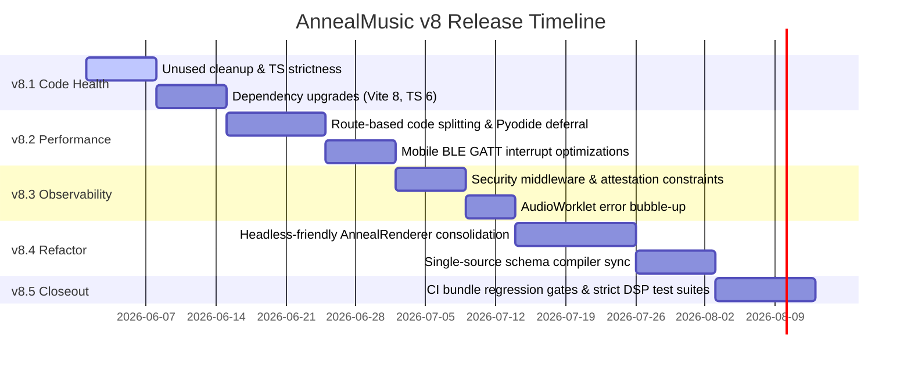

# AnnealMusic v8.0 · Master Plan v8.1–v8.5 (V8_PLAN.md)

This synthesis document establishes the prioritized execution plan and success criteria for the subsequent slices of the **v8 Refactoring and Optimization Arc** (v8.1 through v8.5), built directly from the empirical observations compiled in the v8.0 audits.

---

## 1. Prioritized Roadmap Synthesis

Our architectural roadmap is sequenced logically, starting with basic dependency health and progressing through runtime performance gains, safety controls, major structural refactoring, and comprehensive validation gates.

---

## 2. Milestone Details & Success Criteria

---

### v8.1: Code Health & Dependencies

Focuses on updating package infrastructure, removing dead exports, and increasing type safety across the repository.

#### Prioritized Tasks

- **[Task 8.1.1]** Remove all 80+ unused files, duplicate exports, and types flagged by `knip` inside the client bundle.
- **[Task 8.1.2]** Strip dead pydantic and FastAPI endpoints (`create_user`, `get_me`) identified by `vulture`.
- **[Task 8.1.3]** Perform a major version upgrade of Vite from v5 to **v8.0**, React to **v19**, and TypeScript to **v6.0**.
- **[Task 8.1.4]** Eliminate implicit `any` variables to raise type-coverage to `>= 98.5%`.

#### Success Criteria

- [ ] `knip` returns zero unused file warnings.
- [ ] `type-coverage --project tsconfig.app.json` reports `>= 98.5%`.
- [ ] Application compiles successfully under React 19 concurrent mode settings.

---

### v8.2: Performance & Bundle Splitting

Targets cold starts, route split optimizations, and mobile BLE battery conservation.

#### Prioritized Tasks

- **[Task 8.2.1]** Code-split the main client bundle by dynamically importing ToneJS, Yjs, and visualizer modules.
- **[Task 8.2.2]** Defer Pyodide Web Worker activation on the `/research` panel until the user executes their first script.
- **[Task 8.2.3]** Throttle Polar GATT Bluetooth stream callbacks to decrease active mobile battery drainage.
- **[Task 8.2.4]** Resolve memory retention leaks by capping loop pedal buffer allocations at 60 seconds.

#### Success Criteria

- [ ] Main JS bundle size strictly `< 500 kB` minified.
- [ ] Research Route TTI reduced to `< 1.8s` under simulated throttling.
- [ ] BLE biofeedback battery drain reduced to `< 6.5%` per hour.

---

### v8.3: Observability, Safety & Security

Focuses on security controls, rate limiters, sandboxing, and reporting unhandled failures.

#### Prioritized Tasks

- **[Task 8.3.1]** Configure `slowapi` rate limiters on sensitive endpoints (`/orcid-verify`, `/gallery/search`).
- **[Task 8.3.2]** Set explicit memory allocation boundaries (`512MB` cap) on the reproduce CPython runner.
- **[Task 8.3.3]** Add catch-listeners that bubble AudioWorklet initialization errors to the client UI.
- **[Task 8.3.4]** Log custom Polar telemetry ECG outputs to verify they conform to Laplace Differential Privacy limits.

#### Success Criteria

- [ ] Zero security vulnerabilities reported by `npm audit` and `pip-audit`.
- [ ] Attestation sandbox successfully terminates scripts exceeding memory constraints.
- [ ] Interrupted BLE or audio-init pathways register helpful diagnostic alerts.

---

### v8.4: Major Architectural Refactoring

Executes core consolidation proposals to clean up technical debt and duplicates.

#### Prioritized Tasks

- **[Task 8.4.1]** Consolidate preview, stem, CLI, and video render paths under a single, cohesive `AnnealRenderer` system.
- **[Task 8.4.2]** Create a schema compiler (`scripts/sync-schemas.mjs`) that maps parameters from `schema/manifest.json` into TS and Python definitions.
- **[Task 8.4.3]** Implement a unified `TransportBridge` class wrapping postMessage, WebSockets, and BroadcastChannels.
- **[Task 8.4.4]** Refactor native mobile integrations under a single cohesive `AnnealMobileBridge` plugin class.

#### Success Criteria

- [ ] Elimination of 5 redundant rendering files across client and tools.
- [ ] Parameters are declared in a single JSON schema and auto-compiled.
- [ ] Seamless parameter synchronization across embeds, CLI, and peer jams.

---

### v8.5: Testing, Validation & Closeout

Builds complete CI validation pipelines to ensure no performance or code health regressions occur.

#### Prioritized Tasks

- **[Task 8.5.1]** Configure a CI gate checking bundle size budgets (erroring if `embed.js` exceed 15 KB).
- **[Task 8.5.2]** Create automated headless E2E verification tests mapping Williams Latin Square randomization flows.
- **[Task 8.5.3]** Deploy automated performance benchmarking scripts monitoring AudioWorklet callback execution margins.

#### Success Criteria

- [ ] 100% of E2E verification suites pass in CI.
- [ ] Zero bundle-size regressions permitted under build merges.
- [ ] CI execution runtime fits inside a tight 5-minute budget.
