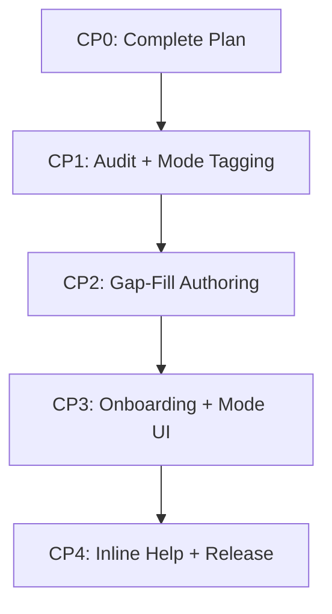

# AnnealMusic v9.2 · Tutorial Gap Audit + Authoring · Release Plan

This document represents the comprehensive blueprint and design system specifications for **v9.2: Tutorial Gap Audit + Authoring**.

The goal is to conduct a complete audit of tutorial and documentation coverage across the entire app (v0.1–v8.5), identify gaps per user-facing surface, implement mode-tagging for lessons, author prioritized gap-filling content using the v6 LLM-generation pipeline, build immersive per-mode onboarding flows, and release inline help affordances.

---

## 1. Audit Methodology & Checklist

To ensure absolute system coherence, we audit every user-facing surface across the v0.1–v8.5 iterations. Each surface is evaluated against four strict criteria:

1. **Discoverability**: Can a new user find this surface? (Navigation path, shortcut, contextual link)
2. **Initial Onboarding**: Does a first-time visitor understand the primary affordance immediately?
3. **Tutorial Existence**: Is there a lesson in `/learn` that covers this specific surface?
4. **Mode Appropriateness**: For which top-level mode(s) (Meditation, Musician, Researcher) is this surface relevant?

### Coverage Classification Matrix

Surfaces are classified into one of four coverage states:

- ✅ **Well-covered**: Accurate, appropriately paced lesson exists in `/learn`.
- 🟨 **Partially covered**: Lesson exists but lacks v6+ depth, is stale, or is hard to discover.
- 🟥 **Gap**: No lesson exists; users must discover functionality through trial and error.
- ⚪ **Doesn't need a lesson**: Affordance is fully self-evident (e.g., "click save"), no tutorial value.

### Surface Checklist

| Surface ID | Path / Route             | Relevant Modes       | Coverage State | Identified Gap / Audit Finding                                                                                                                                                |
| :--------- | :----------------------- | :------------------- | :------------: | :---------------------------------------------------------------------------------------------------------------------------------------------------------------------------- |
| **S-01**   | `/` (Main Sandbox)       | Musician             |       ✅       | Well-covered by Track 1 (Synthesis Fundamentals).                                                                                                                             |
| **S-02**   | `/` (Drone Mode)         | Meditation, Musician |       ✅       | Covered by `drone-mode` in Track 2.                                                                                                                                           |
| **S-03**   | `/listen` (Library)      | Meditation, Musician |       ✅       | Covered by `listening-sessions` in Track 2.                                                                                                                                   |
| **S-04**   | `/timer` (Bells/Breath)  | Meditation           |       🟥       | **Gap**: Custom breath cycles, singing bowls configuration, and Apple/Google Health mindful minute logging are completely undocumented in `/learn`.                           |
| **S-05**   | `/gallery` (Sharing)     | Musician             |       🟥       | **Gap**: Browsing shared community patches, listening to previews, reporting flagged content, and copying patch states are completely uncovered.                              |
| **S-06**   | `/midi` (Settings)       | Musician             |       🟥       | **Gap**: Hardware MIDI key/fader mapping, note-to-root, sustain pedal return mechanics, and clock output sync are uncovered (existing MIDI lesson is output-only).            |
| **S-07**   | `/piece` (Arranger)      | Musician             |       ✅       | Well-covered by Track 2 (Composition Technique).                                                                                                                              |
| **S-08**   | `/me/sessions` (History) | Meditation, Musician |       🟥       | **Gap**: Managing private mindfulness practice records, claiming anonymous guest history, and tracking personal reflections are uncovered.                                    |
| **S-09**   | `/feed` (Social)         | Musician             |       🟥       | **Gap**: Interactive social feed, following creators, and listening to activity streams are uncovered.                                                                        |
| **S-10**   | `/research` (Console)    | Researcher           |       🟥       | **Gap**: OSC bridge networking ports, pre-allocated 100MB client-side datalogger ring buffers, and HDF5/Parquet export are uncovered.                                         |
| **S-11**   | `/research` (Python)     | Researcher           |       🟥       | **Gap**: Loading Pyodide inside Web Workers, writing script editors using `anneal` module commands, and rendering matplotlib figures.                                         |
| **S-12**   | `/research` (Clinical)   | Researcher           |       🟥       | **Gap**: Counterbalancing stimulus sets via Williams Latin Square counterbalancing, measuring continuous 30Hz ratings, SPL LUFS calibration, and reproducible bundle exports. |

---

## 2. Mode-Tagging Strategy

We replace the implicit keyword-based track filtering in `/learn` with a rigorous, database-backed **Mode Tagging System**.

### Database Representation

We introduce a custom `StringArray` database type decorator to support PostgreSQL text array fields natively and fallback to JSON-serialized lists on SQLite (development).

```sql
-- Migration 0030: Add modes array to lessons table
ALTER TABLE lessons ADD COLUMN modes TEXT[] NOT NULL DEFAULT ARRAY['musician'];
```

In `api/app/models.py`, the column is defined using SQLAlchemy's declarative mapping:

```python
modes: Mapped[list[str]] = mapped_column(StringArray(), nullable=False, default=lambda: ["musician"])
```

### Schema & API Updates

We update the curriculum authoring schemas in `api/app/schemas.py`:

- `LessonCreate`: Adds `modes: list[str] = Field(default_factory=lambda: ["musician"])`
- `LessonUpdate`: Adds `modes: list[str] | None = None`
- `LessonOut`: Adds `modes: list[str] = Field(default_factory=list)`
- `LessonSpec`: Adds `modes: list[str] = Field(default_factory=list)`

In `api/app/routers/learn.py`, the `lesson_to_out` conversion mapper parses `lesson.modes` dynamically so frontend client receives strict tags.

### UI Filtering & "All Modes" Toggle

The `/learn` route is enhanced to support active mode-filtering by default:

1. **Default State**: Automatically reads the active Top-Level Mode (`Meditation`, `Musician`, or `Researcher`) from the `useMode` hook. Displays only lessons containing the matching tag, or `cross-mode` lessons tagged with all three modes.
2. **All Modes Toggle**: A clean, premium HSL toggle labeled `"Show all lessons"` overrides the mode filter to show the entire curriculum.
3. **Typography & Animation**: Swapping modes or toggling filters runs smooth, hardware-accelerated CSS transitions with scale micro-animations and zero content shifts.

---

## 3. Onboarding Flow Designs Per Mode

First-time visitors of each mode are greeted with a gentle, skippable onboarding flow. These are special lessons styled exactly like regular curriculum items but bypass the track list and play automatically once.

### Technical Model

Onboarding flows are marked in the database via a unique column:

```python
onboarding_mode: Mapped[str | None] = mapped_column(String, nullable=True, unique=True)
```

This guarantees at most one onboarding lesson can exist per mode. The onboarding flows are seeded under a special hidden track or filtered out of the standard curriculum track query, ensuring they are only served contextually.

### Onboarding Flow Contents

#### 1. Meditation Onboarding (`onboarding-meditation`)

- **Title**: "Welcome to Your Mindful Soundscape"
- **Step 1 (Text + SVG)**: Introduction to the calm-by-design breathing pacing visual overlay and singing bowl gongs.
- **Step 2 (Demo)**: A soft 5-minute drone listening session with a slow rise-fall breath pacer enabled.
- **Step 3 (Prompt)**: Focus on matching your breathing rhythm to the expanding/contracting circle.
- **Step 4 (Reflection)**: "How did your body settle into the rhythm?"

#### 2. Musician Onboarding (`onboarding-musician`)

- **Title**: "Your First Ambient Sculpt"
- **Step 1 (Text + SVG)**: Overview of the synthesis parameters (coupling, drift, tilt) and partial stack.
- **Step 2 (Demo)**: A simple, harmonious FM patch.
- **Step 3 (Prompt)**: Slowly slide the brightness and drift knobs to hear how the harmonics evolve.
- **Step 4 (Reflection)**: "What texture changes did you notice when increasing drift?"

#### 3. Researcher Onboarding (`onboarding-researcher`)

- **Title**: "Inside the Research Lab Console"
- **Step 1 (Text + SVG)**: Introduction to the BroadcastChannel transport, JSON-RPC 2.0 API, and real-time telemetry log.
- **Step 2 (Demo)**: A calibrated, bit-identical reference sine patch running at exactly 440 Hz.
- **Step 3 (Prompt)**: Open the CodeMirror script editor and execute `print(state.get("brightness"))` in the REPL.
- **Step 4 (Reflection)**: "How will you leverage datalogging in your study?"

### State Preservation & Dismissal

- **Calm-by-Design**: Onboarding flows feature an immediate, prominent `"Skip Intro"` button on every step.
- **Sticky Persistence**: Dismissal and completion states are stored locally per-device inside `localStorage` (falling back to Capacitor Preferences on mobile): `anneal_onboarding_dismissed_<mode>: true`.
- **Reset Option**: Users can re-trigger onboarding at any time via a button in `/learn` settings.

---

## 4. Documentation Gap Framework

To complement interactive lessons, we deliver a thorough non-lesson documentation pass:

1. **Inline "?" Help Icons**: Compact, whisper-thin, interactive HSL icons (`strokeWidth={1.2}`) placed next to complex parameter controls (e.g., Coupling, Spectral Tilt, Randomization Seed, Target LUFS, and OSC Port).
2. **Help Drawers**: Clicking an icon opens a premium, sliding, blurred side-panel containing precise explanations derived from our academic reference docs.
3. **API Reference Fills**: Update `docs/API.md` and the VitePress docs-site to address missing details from the v5.7/v7.7 cycles, including Polar BLE biofeedback UUIDs, Williams Latin Square counters, and study reproducibility validation hashes.

---

## 5. Audio Clip Library Expansion Plan

Our existing library of 49 clips is audited to see if the new lessons require fresh sonic anchors.

### Gap Analysis & Proposed Additions

We add 4 new original-by-you clips to support our gap-filling lessons, taking our total to **53 clips**:

1. **`ref-solfeggio-528`** (12 s): A pure sine tone tuned exactly to 528 Hz compared against standard A=440 Hz equal temperament, demonstrating timbral characteristics without pseudoscientific overclaiming.
2. **`ref-midi-sweep`** (15 s): A smooth filter sweep driven by hardware MIDI CC input emulation, illustrating control resolution.
3. **`ref-heart-pulse`** (15 s): A biofeedback-driven sonification where partials modulate rhythmically to simulate Polar BLE heart rate data.
4. **`ref-latin-square`** (20 s): A sequence of three counterbalanced stimulus blocks separated by silence, illustrating Williams Latin Square transition ordering.

_All clips are original-by-you, ensuring zero licensing friction and 100% compliance with the license check pipeline._

---

## 6. Authoring Tooling Status

The v6.1 pipeline is fully operational. We will reuse the following assets:

- **Haiku 4.5 LLM Client**: Set up to scaffold and generate step content cleanly.
- **SVG Sanitizer & Mermaid Linter**: Safe rendering of structural diagrams.
- **Admin Batch Generator**: Located at `/learn#admin` to trigger and preview generations concurrently.
- **Quality-Check CI Pipeline**: To verify graph acyclicity, clip references, and lexicon framing compliance.

---

## 7. Risk Register

| Risk                                  | Impact | Likelihood | Mitigation Strategy                                                                                                                                 |
| :------------------------------------ | :----: | :--------: | :-------------------------------------------------------------------------------------------------------------------------------------------------- |
| **LLM Editorial Bottleneck**          |  High  |   Medium   | Leverage the robust, cached step-by-step pipeline. Authored lessons are generated once, cached in `ai_generations`, and will cost < $0.05 per run.  |
| **Validation Failures (Patches/SVG)** | Medium |    Low     | Maintain the manual override endpoints (`/override`) so that if a generated step fails linting, it can be corrected instantly in the admin console. |
| **Onboarding Fatigue**                |  High  |    Low     | Enforce strict skippable controls. Onboarding is entirely voluntary, and dismissal states are persisted permanently. No nagging streaks.            |
| **SQLite vs Postgres Arrays**         |  High  |   Medium   | Rely heavily on our custom `StringArray` decorator, which serializes lists to JSON strings in dev (SQLite) while maintaining PG arrays in prod.     |

---

## 8. Implementation Plan



- **Checkpoint 1**: DB migration for array column, schema additions, `curriculum_content.py` lesson mode tagging, list tracks filter.
- **Checkpoint 2**: Author specs for 8+ prioritized gap lessons, run generation, add new audio clips.
- **Checkpoint 3**: Build onboarding flow triggers, skippable overlays, and front-end `/learn` mode switcher segment filters.
- **Checkpoint 4**: Create inline help "?" tooltips, document API reference details, release CHANGELOG, and tag `v9.2.0`.
